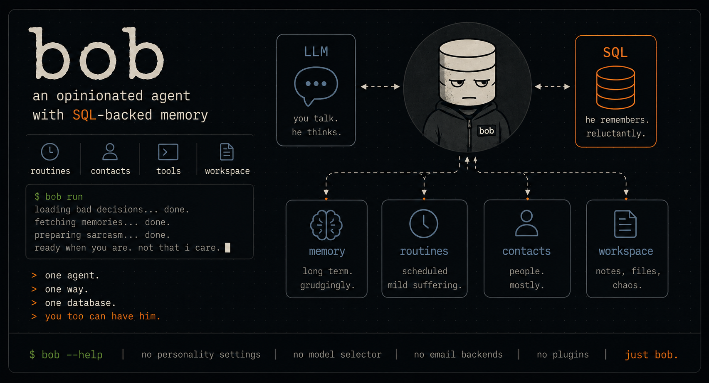

# bob



**An opinionated personal agent with SQL-backed memory.**

bob is a small, stubborn agent backed by a SQL database.

He remembers things, runs routines, keeps workspace state, and acts through tools. He does not offer a personality selector, model picker, plugin marketplace, or twelve competing abstractions for memory.

There is no agent builder here.

There is just bob.

You too can have him.

## Feature Areas

### WhatsApp Messaging

Bob connects to WhatsApp through a Go companion service (the WhatsApp Bridge) that links to WhatsApp Web via the `whatsmeow` library. It handles both direct messages and group chats, with support for text, images, and documents. Messages flow through a persistent SQLite queue with guaranteed delivery and automatic retries. Contacts are auto-seeded from shared contact cards. Proactive outreach tools let Bob initiate conversations with trusted contacts. A pairing system supports both QR code and phone number methods.

### Voice Chat

Real-time voice conversations run over WebSockets with a full STT/TTS pipeline. Bob uses Faster Whisper for speech-to-text (with CUDA acceleration) and Omnivoice for text-to-speech. The system supports barge-in detection, silence detection, multi-language conversations with language tagging, and session-based conversation tracking. Voice sessions are stored as unified session messages alongside text and email interactions.

### Phone Calls

Phone integration uses Twilio Media Streams for real-time bidirectional audio during voice calls. Bob can initiate outbound calls to contacts and handle inbound calls, with automatic contact resolution from caller ID. Calls are recorded and each exchange is logged with detailed timing metrics (STT latency, LLM latency, TTS latency, end-to-end latency). The `make_phone_call` tool lets the LLM dial contacts directly, and `get_call_status` tracks call progress.

### Email

Bob reads and sends email through AgentMail. A polling service checks inboxes for new messages, resolves contacts from sender addresses, and dispatches the LLM with email context and reply tools. The system supports multiple inboxes, thread management, attachment handling (downloaded from trusted senders), and trust-based handling policies. Replies are sent back through the AgentMail API.

### Dispatch System

Every agent interaction is tracked as a dispatch, whether it is a WhatsApp message response, an email reply, a voice conversation, or a phone call. Dispatches have their own lifecycle (active, completed, failed, timed_out, cancelled) with concurrency limits, stuck detection, and automatic tapping. This gives Bob a unified view of everything the agent is doing across all channels.

### Session Management

Every conversation is a session, identified by a session key that encodes the channel and peer (e.g. `agent:main:whatsapp:direct:+61400111222`). Sessions have agendas (purpose and handling instructions), participants (with trust levels), and periodic summaries. Session routes map logical keys to physical channels for cross-session routing. The unified `session_messages` table stores all conversation history across voice, phone, email, and WhatsApp.

### Reflection

The reflection service lets users ask questions about any session's history. It builds a transcript from the session's messages and LLM call log, then dispatches an LLM call to analyze the conversation, trace tool invocations, explain agent decisions, and identify errors or missed opportunities. This is useful for debugging agent behavior and understanding what happened during an autonomous session.

### Dashboard

A React-based web dashboard provides real-time monitoring and management. It shows active sessions across all channels, LLM call statistics and latency metrics, contact management, workspace file browsing, phone call recordings with transcripts, and active dispatch monitoring. A WebSocket connection provides live updates.

### Calendars and Events

Calendars support color-coded entries with events, recurring schedules, and recipient tracking. Events link to contacts and sessions for cross-channel reminders and notifications.

### Notifications and Webhooks

Persisted notifications with acknowledgement, delivery state, and repeat throttling. Webhook delivery with retry tracking for external integrations. Cross-session routing for source and target session resolution.

## Data Model

```text
Legend: 1 --< many, >--< many-to-many, self = self-reference

=== Sessions and Messaging ===

+------------------------+      +------------------------+
| session_routes         | >--1 | contacts               |
| PK id                  |      | PK id                  |
| session_key, channel,  |      | is_default, phone,     |
| kind, chat_id,         |      | email, whatsapp_groups,|
| FK contact_id          |      | trust_level, metadata  |
+------------------------+      +------------------------+

+------------------------+
| session_messages       |
| PK id                  |
| session_key, role,     |
| content, metadata      |
+------------------------+

+------------------------+      +------------------------+
| session_agendas        |      | session_participants   |
| PK id                  |      | PK id                  |
| session_key, purpose,  |      | session_key,           |
| handling_instructions  |      | contact_id, trust,     |
+------------------------+      | last_active            |
                                +------------------------+

+------------------------+
| session_summaries      |
| PK id                  |
| session_key, summary,  |
| topics, participants   |
+------------------------+

=== Dispatches ===

+------------------------+
| dispatches             |
| PK id                  |
| session_key, category, |
| status, tap_count,     |
| duration, metadata     |
+------------------------+

=== Phone Calls ===

+------------------------+1 --< +----------------------------+
| phone_calls            |      | phone_call_exchanges       |
| PK id                  |      | PK id                      |
| call_sid, direction,   |      | FK phone_call_id           |
| status, duration,      |      | transcript, timing metrics |
| recording_path,        |      | (STT, LLM, TTS, e2e)       |
| contact_id, agenda     |      +----------------------------+
+------------------------+

=== Email ===

+------------------------+1 --< +------------------------+
| email_inboxes          |      | email_messages          |
| PK id                  |      | PK id                   |
| inbox_id, status,      |      | FK inbox_id             |
| metadata               |      | message_id, thread_id,  |
+------------------------+      | from/to/subject/body,   |
                                | attachments (JSON)      |
                                +------------------------+

+------------------------+
| email_threads          |
| PK id                  |
| thread_id, session_key,|
| contact_id, agenda     |
+------------------------+

=== Calendars ===

+------------------------+1 --< +------------------------+1 --< +------------------------+
| calendars              |      | events                 |      | event_recipients       |
| PK id                  |      | PK id                  |      | PK id                  |
| metadata               |      | FK calendar_id         |      | FK event_id            |
+------------------------+      +------------------------+      +------------------------+

=== Other ===

+------------------------+1 --< +------------------------+
| webhook_configs        |      | webhook_deliveries     |
| PK id                  |      | PK id                  |
| events                 |      | FK webhook_id          |
+------------------------+      +------------------------+

+------------------------+
| notifications          |
| PK id                  |
| entity_type,           |
| entity_id,             |
| notification_type,     |
| status, delivery_*,    |
| metadata               |
+------------------------+

+------------------------+
| skill_delegations      |
| PK id                  |
| dispatch_id, skill,    |
| status, result         |
+------------------------+
```

## System Architecture

```text
                         +-----------------+
                         |   Web Dashboard |
                         |   (React SPA)   |
                         +--------+--------+
                                  |
                          HTTP/WS | :8420
                                  |
+--------+   +--------+   +------+-------+   +-----------+   +-----------+
| WhatsApp|   |  Email |   |              |   |  Voice    |   |   Phone   |
| Bridge  |   | (Agent |   |  Bob         |   |  Chat     |   |  (Twilio) |
| (Go)    |   |  Mail) |   |  Server      |   |  (WS/STT/ |   |  (Media   |
|         |   |        |   |  (FastAPI)   |   |   TTS)    |   |  Streams) |
+----+----+   +----+---+   +------+-------+   +-----+-----+   +-----+-----+
     |             |               |                 |               |
     | WS :8430    |  Polling      |                 | WS            | WS
     |             |               |                 |               |
+----+----+        |        +------+--------+        |               |
| WhatsApp|        |        |               |        |               |
|  Web    |        +------->|    SQLite     |<-------+               |
| (whats- |                 |   Database    |                        |
|  meow)  |                 |               |                        |
+---------+                 +---------------+                        |
                                                                     |
                               +-------------------+                 |
                               |      Twilio       |<----------------+
                               |   (PSTN/Mobile)   |
                               +-------------------+
```

## Setup

### Prerequisites

- Python 3.12+
- [uv](https://docs.astral.sh/uv/) package manager
- Go 1.22+ (for WhatsApp bridge)
- CUDA GPU (recommended for voice STT)
- A Twilio account (for phone calls)
- An AgentMail account (for email)

### Install Bob Server

```bash
git clone <repo-url> cyborg
cd cyborg
uv sync --extra dev
```

### Configure Environment

Cyborg reads `CYBORG_*` settings from the process environment and auto-loads `.env` files.

Load order:

1. Existing process environment
2. `CYBORG_ENV_FILE`, if set
3. `.env` in the current working directory
4. `.env` in the resolved config directory, usually `~/.config/cyborg/.env`

Create the config directory and env file:

```bash
mkdir -p ~/.config/cyborg
cat > ~/.config/cyborg/.env <<'EOF'
# Core
CYBORG_PORT=8420
CYBORG_DASHBOARD_SECRET=your-dashboard-secret

# LLM
CYBORG_OPENAI_API_KEY=sk-...

# WhatsApp Bridge
CYBORG_WHATSAPP_BRIDGE_ENABLED=true
CYBORG_WHATSAPP_BRIDGE_URL=ws://127.0.0.1:8430/ws
CYBORG_WHATSAPP_BRIDGE_TOKEN=your-bridge-token

# Email (optional)
CYBORG_AGENTMAIL_API_KEY=...

# Phone (optional)
CYBORG_PHONE_ENABLED=true
CYBORG_PHONE_TWILIO_ACCOUNT_SID=AC...
CYBORG_PHONE_TWILIO_AUTH_TOKEN=...
CYBORG_PHONE_TWILIO_PHONE_NUMBER=+1...
CYBORG_PHONE_BASE_URL=https://your-public-url
EOF
```

### Install and Start the WhatsApp Bridge

The WhatsApp bridge is a Go companion service that connects to WhatsApp Web:

```bash
cd services/whatsappbridge
make build
make install   # copies binary to ~/.local/bin/whatsappbridge
```

Configure the bridge. Create `~/.local/share/cyborg/whatsappbridge/.env` or set environment variables:

```bash
export WHATSAPPBRIDGE_HOST=127.0.0.1
export WHATSAPPBRIDGE_PORT=8430
export WHATSAPPBRIDGE_TOKEN=your-bridge-token    # must match CYBORG_WHATSAPP_BRIDGE_TOKEN
export WHATSAPPBRIDGE_DATA_DIR=$HOME/.local/share/cyborg/whatsappbridge
```

Start the bridge:

```bash
whatsappbridge
```

Then pair your WhatsApp account. Use the Bob CLI to request a pairing code:

```bash
uv run cyborg whatsapp pair --phone +61400111222
```

Or scan a QR code from the dashboard at `http://localhost:8420/dashboard`.

### Start Bob

Run directly:

```bash
uv run cyborg serve
```

Or install as a systemd user service:

```bash
uv run cyborg install
uv run cyborg start
```

The service listens on `127.0.0.1:8420` by default.

- Dashboard: `http://localhost:8420/dashboard`
- Swagger UI: `http://localhost:8420/docs`
- ReDoc: `http://localhost:8420/redoc`
- Health: `http://localhost:8420/health`

### Dashboard Development

The dashboard is a React SPA (Vite + TypeScript + Tailwind) in `packages/cyborg-server/cyborg_server/ui_app/`.

```bash
cd packages/cyborg-server/cyborg_server/ui_app
npm install
npm run dev
```

The Vite dev server runs on port 5173 and proxies API and WebSocket requests to the backend at `127.0.0.1:8420`:

| Path | Proxies to |
|---|---|
| `/dashboard/api` | `http://127.0.0.1:8420` |
| `/dashboard/ws` | `ws://127.0.0.1:8420` |
| `/phone` | `http://127.0.0.1:8420` |

So the backend must be running separately (`uv run cyborg serve`) for the dev dashboard to work.

For production, `npm run build` outputs static files to `ui_dist/`, which the FastAPI server serves at `/dashboard`.

## CLI

```bash
uv run cyborg --help
```

Service management:

```bash
uv run cyborg install      # Create systemd user service
uv run cyborg start        # Start service
uv run cyborg restart      # Restart service
uv run cyborg status       # Check service status
uv run cyborg logs -f      # Follow service logs
uv run cyborg stop         # Stop service
uv run cyborg uninstall    # Remove systemd service
```

### Command Reference

| Group | Commands |
|---|---|
| `contact` | `create`, `list`, `get`, `update`, `delete`, `by-phone`, `by-email`, `by-whatsapp-group`, `set-default`, `get-default`, `clear-default` |
| `notification` | `list`, `get`, `ack`, `process-due` |
| `session-route` | `create`, `list`, `get`, `update`, `delete` |
| `calendar` | `create`, `list`, `get`, `update`, `delete` |
| `event` | `create`, `list`, `get`, `update`, `delete`, `confirm`, `cancel`, `recipients`, `recipient-add`, `recipient-update` |
| `context` | `summary`, `calendar` |
| `webhook` | `create`, `list`, `get`, `by-name`, `update`, `delete`, `deliveries`, `delivery-get`, `delivery-retry`, `process-pending` |
| `call` | `list`, `get` |
| `email` | `inbox-list`, `inbox-get`, `send`, `reply`, `process-pending` |
| `whatsapp` | `status`, `pair`, `send`, `bridge-status` |
| `memory` | `seed` |
| `openai` | `prompt` |
| `eval` | `list`, `run`, `history` |

## Calendars and Events

```bash
curl -X POST http://127.0.0.1:8420/api/v1/calendars \
  -H 'content-type: application/json' \
  -d '{"name": "Bob", "color": "#2A9D8F", "is_default": true}'

curl -X POST http://127.0.0.1:8420/api/v1/events \
  -H 'content-type: application/json' \
  -d '{
    "calendar_id": "<calendar-id>",
    "title": "Standup",
    "start_time": "2026-03-10T09:00:00+00:00",
    "end_time": "2026-03-10T09:15:00+00:00",
    "timezone": "UTC"
  }'
```

## Webhooks

```bash
curl -X POST http://127.0.0.1:8420/api/v1/webhooks \
  -H 'content-type: application/json' \
  -d '{
    "name": "my-webhook",
    "url": "https://example.com/webhook",
    "secret": "supersecret",
    "events": ["dispatch.created", "dispatch.completed"],
    "retry_count": 3
  }'

curl -X POST http://127.0.0.1:8420/api/v1/webhooks/process-pending
```

## Configuration Reference

### General

| Variable | Default | Description |
|---|---|---|
| `CYBORG_HOST` | `127.0.0.1` | Bind address |
| `CYBORG_PORT` | `8420` | Port |
| `CYBORG_DATA_DIR` | `~/.local/share/cyborg` | Data directory |
| `CYBORG_CONFIG_DIR` | `~/.config/cyborg` | Config directory |
| `CYBORG_DB_PATH` | `{data_dir}/cyborg.db` | Database path |
| `CYBORG_LOG_LEVEL` | `info` | Logging level |
| `CYBORG_LOG_PATH` | *(none)* | Log file path |
| `CYBORG_DB_POOL_SIZE` | `4` | Connection pool size |
| `CYBORG_PUBLIC_URL` | *(none)* | Public URL for webhook callbacks |
| `CYBORG_DASHBOARD_SECRET` | *(none)* | Shared secret for dashboard operations |
| `CYBORG_HEARTBEAT_INTERVAL_SECONDS` | `60` | Heartbeat and notification dispatch interval |

### LLM

| Variable | Default | Description |
|---|---|---|
| `CYBORG_OPENAI_API_KEY` | *(none)* | OpenAI API key |
| `CYBORG_OPENAI_BASE_URL` | `https://api.openai.com/v1` | OpenAI API base URL |
| `CYBORG_OPENAI_DEFAULT_MODEL` | `gpt-5.4-mini` | Default model |
| `CYBORG_OPENAI_TIMEOUT_SECONDS` | `120` | Request timeout |
| `CYBORG_OPENAI_WEB_SEARCH` | `false` | Enable web search tool |

### WhatsApp Bridge

| Variable | Default | Description |
|---|---|---|
| `CYBORG_WHATSAPP_BRIDGE_ENABLED` | `false` | Enable WhatsApp bridge client |
| `CYBORG_WHATSAPP_BRIDGE_URL` | `ws://127.0.0.1:8430/ws` | Bridge WebSocket URL |
| `CYBORG_WHATSAPP_BRIDGE_TOKEN` | *(none)* | Auth token for bridge connection |
| `CYBORG_WHATSAPP_BRIDGE_RECONNECT_INTERVAL_SECONDS` | `10` | Reconnect interval |

WhatsApp bridge (Go companion) variables:

| Variable | Default | Description |
|---|---|---|
| `WHATSAPPBRIDGE_HOST` | `127.0.0.1` | Bridge listen host |
| `WHATSAPPBRIDGE_PORT` | `8430` | Bridge listen port |
| `WHATSAPPBRIDGE_TOKEN` | *(none)* | Auth token (must match Bob side) |
| `WHATSAPPBRIDGE_DATA_DIR` | `~/.local/share/cyborg/whatsappbridge` | Data directory |
| `WHATSAPPBRIDGE_LOG_LEVEL` | `info` | Log level |

### Voice

| Variable | Default | Description |
|---|---|---|
| `CYBORG_VOICE_ENABLED` | `true` | Enable voice chat |
| `CYBORG_VOICE_STT_MODEL` | `large-v3-turbo` | Faster Whisper model |
| `CYBORG_VOICE_STT_DEVICE` | `cuda` | STT device (cuda/cpu) |
| `CYBORG_VOICE_STT_COMPUTE_TYPE` | `int8` | STT compute type |
| `CYBORG_VOICE_TTS_NUM_STEPS` | `16` | TTS generation steps |
| `CYBORG_VOICE_VOICES_DIR` | `~/.openclaw/bobvoice-voices` | Voice profiles directory |
| `CYBORG_VOICE_SESSION_MAX_AGE_DAYS` | `30` | Session data retention |

### Phone

| Variable | Default | Description |
|---|---|---|
| `CYBORG_PHONE_ENABLED` | `false` | Enable phone integration |
| `CYBORG_PHONE_TWILIO_ACCOUNT_SID` | *(none)* | Twilio Account SID |
| `CYBORG_PHONE_TWILIO_AUTH_TOKEN` | *(none)* | Twilio Auth Token |
| `CYBORG_PHONE_TWILIO_PHONE_NUMBER` | *(none)* | Twilio phone number |
| `CYBORG_PHONE_BASE_URL` | *(none)* | Public URL for Twilio callbacks |
| `CYBORG_PHONE_CALL_RECORDING_ENABLED` | `true` | Record calls |
| `CYBORG_PHONE_CALL_RECORDING_MAX_AGE_DAYS` | `30` | Recording retention |

### Email

| Variable | Default | Description |
|---|---|---|
| `CYBORG_AGENTMAIL_API_KEY` | *(none)* | AgentMail API key |
| `CYBORG_AGENTMAIL_DEFAULT_INBOX_ID` | *(none)* | Default inbox |
| `CYBORG_AGENTMAIL_POLL_INTERVAL_SECONDS` | `30` | Inbox poll interval |
| `CYBORG_EMAIL_POLLING_ENABLED` | `true` | Enable email polling |

### Dispatch

| Variable | Default | Description |
|---|---|---|
| `CYBORG_DISPATCH_CONCURRENCY_LIMIT` | `10` | Max concurrent dispatches |
| `CYBORG_DISPATCH_STUCK_TIMEOUT_MINUTES` | `60` | Timeout before dispatch is considered stuck |
| `CYBORG_DISPATCH_SHUTDOWN_TIMEOUT_SECONDS` | `30` | Grace period on shutdown |

### Webhook Templates

| Variable | Description |
|---|---|
| `CYBORG_WEBHOOK_{NAME}_URL` | URL for webhook named `{NAME}` |
| `CYBORG_WEBHOOK_{NAME}_SECRET` | Secret for webhook named `{NAME}` |
| `CYBORG_WEBHOOK_{NAME}_EVENTS` | Comma-separated events for webhook named `{NAME}` |

### Skill Environment Variables

Skills run as subprocesses and need API keys in standard env var names (e.g. `OPENAI_API_KEY`). Since Cyborg runs as a systemd user service, it does not inherit your shell environment -- it reads `~/.config/cyborg/.env` at startup. To make an API key available to skills:

1. Add the key to `~/.config/cyborg/.env` with the `CYBORG_` prefix:

```bash
echo 'CYBORG_GOOGLE_PLACES_API_KEY=AIza...' >> ~/.config/cyborg/.env
```

2. Register the mapping in `packages/cyborg-server/cyborg_server/services/skill_env.py` so the subprocess sees the standard name:

```python
ENV_MAPPINGS: dict[str, str] = {
    "CYBORG_OPENAI_API_KEY": "OPENAI_API_KEY",
    "CYBORG_OPENAI_BASE_URL": "OPENAI_BASE_URL",
    "CYBORG_AGENTMAIL_API_KEY": "AGENTMAIL_API_KEY",
    "CYBORG_GOOGLE_PLACES_API_KEY": "GOOGLE_PLACES_API_KEY",
}
```

3. Restart the service:

```bash
uv run cyborg restart
```

Skills can then use `os.environ.get("GOOGLE_PLACES_API_KEY")` or rely on SDK auto-detection.

## Testing

```bash
uv run pytest
```

## Data Storage

- Database: `~/.local/share/cyborg/cyborg.db`
- Config: `~/.config/cyborg/`
- Phone recordings: `~/.local/share/cyborg/calls/`
- WhatsApp bridge data: `~/.local/share/cyborg/whatsappbridge/`
- Service: systemd user service (`cyborg.service`)
