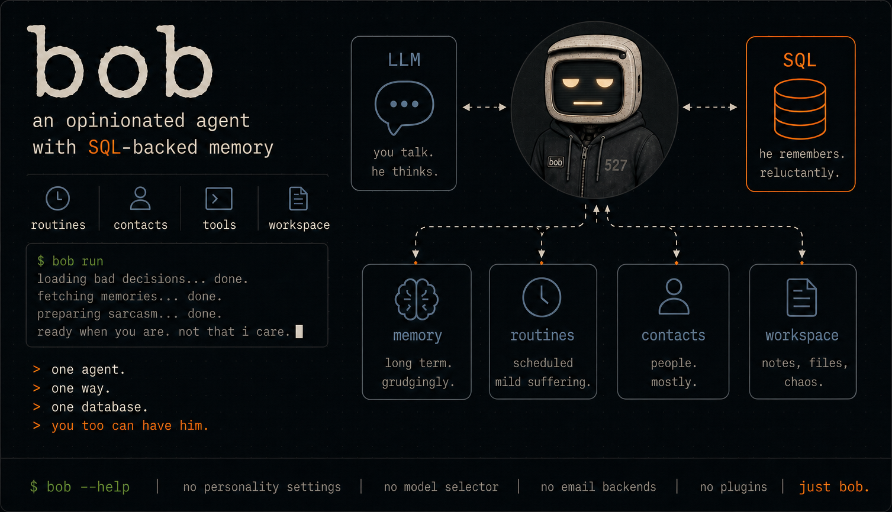

# bob



**An opinionated personal agent with SQL-backed memory.**

bob is a small, stubborn agent backed by a SQL database.

He remembers things, runs routines, keeps workspace state, and acts through tools. He does not offer a personality selector, model picker, plugin marketplace, or twelve competing abstractions for memory.

There is no agent builder here.

There is just bob.

You too can have him.

## Feature Areas

### The Event Pipeline (Bob3 core)

Everything Bob perceives and does flows through one durable pipeline. Every accepted stimulus — a WhatsApp message, an email, a phone call outcome, a wakeup — is appended once to an immutable `event_log`. An attention layer decides whether and when to engage: tier 0 heuristics handle the obvious cases, and a cheap tier-2 LLM probe handles the ambiguous ones (is this group message for Bob?). When attention fires, a `turn` claims the conversation's pending events under a durable lease, runs the LLM dispatch, and records every outbound action in an `effects` outbox before delivery — so replies survive crashes, retries are automatic, and dead effects are inspectable and requeueable from the dashboard. Conversations and bindings form the identity layer that channel-specific session keys map onto, with merge/unmerge provenance.

### WhatsApp Messaging

Bob connects to WhatsApp through a Go companion service (the WhatsApp Bridge) that links to WhatsApp Web via the `whatsmeow` library. It handles direct messages and group chats with text, images, and documents. Messages flow through a persistent queue with guaranteed delivery and automatic retries. Contacts are auto-seeded from shared contact cards; participants carry per-person trust levels. Slash commands (`/who`, `/autoplan`, `/patience`, ...) give operators in-chat control. A pairing system supports both QR code and phone number methods.

### Email

Bob reads and sends email through AgentMail. A polling service checks inboxes, threads messages, resolves contacts from sender addresses, and feeds the event pipeline with email context and reply tools. Multiple inboxes, attachment handling (downloaded from trusted senders), and trust-based handling policies are supported. All email SQL lives behind a single domain store.

### Voice and Phone

Realtime voice runs on the OpenAI Realtime API through one bridge (`realtime_bridge.py`) with pluggable audio sources: Twilio Media Streams for phone calls and raw browser PCM for voice-link sessions. The browser harness is free and instant, so prompts, voices, and tools are iterated there before spending money on real calls. The LLM places calls via `create_subagent(agent_type="openai_voice", modality="phone"|"voice_link")`; outbound calls prewarm the OpenAI session while the phone rings so the callee never hears a half-configured agent. Calls get turn-ordered transcripts, structured `report_success`/`report_failure` outcomes, time-aligned stereo recordings, barge-in handling, and callee-speaks-first etiquette. Both modalities land in the same `phone_calls` table and calls UI.

### Memory

Claim-centric long-term memory (v7): claims are the source of truth, entities are identity-only rows, and rendered views are generated from claims via per-type templates. A reconciliation loop extracts claims from conversation traffic per-session, dedupes and supersedes, raises open questions, and embeds entities for recall. Memory is injected into dispatches as rendered entity blocks, and `memory_correct` tools let the agent (or operator) fix it in place. See `docs/memory.md`.

### Dreams

Idle-time reflection over recent sessions. Dream runs review traffic and propose *resolutions* (behaviour changes) and *plans* (concrete next steps), link them to sessions and entities, and synthesise a journal. Plans can auto-announce into their originating chat under per-session autoplan settings with daily caps. Approved output feeds back into future dispatches.

### Goals, Wakeups and Outreach

Goals hold durable intent with status transitions and deadlines; wakeups schedule future work (one-shot and recurring routines) that re-enters the event pipeline as first-class stimuli. Outreach goals let Bob initiate and drive conversations with trusted contacts toward an objective, reporting outcomes back to the originating session.

### Persona

Bob's identity, soul, and agent instructions are versioned `persona_records` rows — edit in the dashboard, activate any revision, roll back instantly. The active revision is assembled into every system prompt.

### Skills and Subagents

Skills are self-contained subprocess tools with their own dependencies and mapped API keys; a skill-developer subagent can write new ones from a user story, tracked as asynchronous delegations with cost accounting. Subagents (voice calls, isolated task sessions) run as child conversations with their own lifecycle and results dispatch.

### Reflection and Evals

The reflection service answers questions about any session's history: it builds a transcript from messages and the LLM call log, then traces tool invocations, explains decisions, and identifies errors. An eval harness replays recorded scenarios against the live prompt stack for regression checking.

### Dashboard

A React SPA (Vite + TypeScript + Tailwind) served at `/dashboard`: conversations with merged decision timelines (attention verdicts, probe reasoning, turns, effects, goal transitions), ops status (effects outbox, dead-effect requeue, stuck-turn retry, quota gate), memory browser, dream runs and plans, goals and wakeups, persona editor, skills, calls with live transcripts and recordings, contacts, spend telemetry, and log tail. A WebSocket connection provides live updates.

### Calendars, Notifications and Webhooks

Color-coded calendars with events, recurring schedules, and recipient tracking, linked to contacts and sessions for cross-channel reminders. Persisted notifications with acknowledgement and repeat throttling. Webhook delivery with retry tracking for external integrations.

## System Architecture

```text
+-----------+  +---------+  +--------------+  +----------+  +-----------+
| WhatsApp  |  |  Email  |  | Phone/Voice  |  | Wakeups  |  | Operator  |
| Bridge(Go)|  |(Agent   |  | (Twilio +    |  | Routines |  | Dashboard |
| WS :8430  |  |  Mail)  |  |  OpenAI RT)  |  | Heartbeat|  |   CLI     |
+-----+-----+  +----+----+  +------+-------+  +----+-----+  +-----+-----+
      |             |              |               |              |
      v             v              v               v              |
+---------------------------------------------------------+      |
|                     event_log (append-only)             |      |
+---------------------------+-----------------------------+      |
                            v                                    |
+---------------------------------------------------------+      |
|  attention: tier-0 heuristics -> tier-2 LLM probe       |      |
|  (engage now / wait / skip, per conversation)           |      |
+---------------------------+-----------------------------+      |
                            v                                    |
+---------------------------------------------------------+      |
|  turn: leases pending events, assembles context         |      |
|  (persona + memory + agenda + dream plans + goals),     |<-----+
|  runs LLM dispatch with channel tools                   | HTTP/WS :8420
+------------+----------------------------+---------------+
             |                            |
             v                            v
+------------------------+   +---------------------------+
|  effects outbox        |   |  memory reconciliation,   |
|  (record then deliver, |   |  dreams, goals, wakeups,  |
|   retry, dead-letter)  |   |  reflection, telemetry    |
+-----------+------------+   +-------------+-------------+
            |                              |
            v                              v
   back out through the         +---------------------+
   channel adapters             |  SQLite (~/data)    |
   (WhatsApp, email,            |  repositories +     |
    voice, webhooks)            |  domain stores      |
                                +---------------------+
```

One FastAPI process (`bob-server`, port 8420) owns the whole pipeline. All state lives in a single SQLite database behind a table-ownership rule enforced by tests: every table has exactly one writer (a repository under `repositories/` or a domain store like `dream/store.py`), with a short, documented list of cross-domain read seams. Background loops (heartbeat, email polling, dream runs, retention, reconciliation audits) run inside the same process. All realtime voice — Twilio phone calls and browser voice-link sessions — flows through the same Realtime bridge; call placement lives in `voice_dispatch_service.py`, and call records for both modalities land in `phone_calls`.

## Setup

### Prerequisites

- Python 3.12+
- [uv](https://docs.astral.sh/uv/) package manager
- Go 1.22+ (for WhatsApp bridge)
- CUDA GPU (only for the legacy local voice STT pipeline; realtime voice needs none)
- A Twilio account (for phone calls)
- An AgentMail account (for email)

### Install Bob Server

```bash
git clone <repo-url> bob
cd bob
uv sync
```

### Configure Environment

Bob reads `BOB_*` settings from the process environment and auto-loads `.env` files.

Load order:

1. Existing process environment
2. `BOB_ENV_FILE`, if set
3. `.env` in the current working directory
4. `.env` in the resolved config directory, usually `~/config/.env`

Create the config directory and env file:

```bash
mkdir -p ~/config
cat > ~/config/.env <<'EOF'
# Core
BOB_PORT=8420
# API token: leave unset — a secret is auto-generated to ~/data/api_secret.
# (Setting it here would leak it to the agent's bash tool via the environment;
# see "API authentication" below.)
# BOB_DASHBOARD_SECRET=

# LLM
BOB_OPENAI_API_KEY=sk-...

# WhatsApp Bridge
BOB_WHATSAPP_BRIDGE_ENABLED=true
BOB_WHATSAPP_BRIDGE_URL=ws://127.0.0.1:8430/ws
BOB_WHATSAPP_BRIDGE_TOKEN=your-bridge-token

# Email (optional)
BOB_AGENTMAIL_API_KEY=...

# Phone (optional)
BOB_PHONE_ENABLED=true
BOB_PHONE_TWILIO_ACCOUNT_SID=AC...
BOB_PHONE_TWILIO_AUTH_TOKEN=...
BOB_PHONE_TWILIO_PHONE_NUMBER=+1...
BOB_PHONE_BASE_URL=https://your-public-url
EOF
```

### Install and Start the WhatsApp Bridge

The WhatsApp bridge is a Go companion service that connects to WhatsApp Web:

```bash
cd services/whatsappbridge
make build
make install   # copies binary to ~/.local/bin/whatsappbridge
```

Configure the bridge. Create `~/data/whatsappbridge/.env` (the bridge loads `.env` files at startup — same precedence as the Python service: existing env > `$BOB_ENV_FILE` > `./.env` > `$BOB_CONFIG_DIR/.env` > `$WHATSAPPBRIDGE_DATA_DIR/.env`):

```bash
WHATSAPPBRIDGE_HOST=127.0.0.1
WHATSAPPBRIDGE_PORT=8430
WHATSAPPBRIDGE_TOKEN=your-bridge-token    # must match BOB_WHATSAPP_BRIDGE_TOKEN
WHATSAPPBRIDGE_DATA_DIR=$HOME/data/whatsappbridge
```

Start the bridge:

```bash
whatsappbridge
```

Then pair your WhatsApp account. Use the Bob CLI to request a pairing code:

```bash
uv run bob whatsapp pair --phone +61400111222
```

Or scan a QR code from the dashboard at `http://localhost:8420/dashboard`.

### Start Bob

Run directly:

```bash
uv run bob serve
```

Or install as a systemd user service:

```bash
uv run bob install
uv run bob start
```

The service listens on `127.0.0.1:8420` by default.

- Dashboard: `http://localhost:8420/dashboard`
- Swagger UI: `http://localhost:8420/docs`
- ReDoc: `http://localhost:8420/redoc`
- Health: `http://localhost:8420/health`

## Bob Instances (Docker)

The primary instance runs from this checkout under systemd (`./deploy.sh`). Additional Bob instances run via Docker — the image bundles the server, the built dashboard, the claude CLI harness, and the core skill bundle. Registry: `ghcr.io/mike-crabcat/bob` (public). Full design: `docs/bob-docker-plan.md`.

### Throwaway test instance (this box)

```bash
BOB_PORT=8421 docker compose -p test-1 -f compose.yaml -f compose.ephemeral.yaml up -d
```

The ephemeral override swaps bind mounts for named volumes, so `docker compose -p test-1 down -v` erases the whole instance — data, workspace, claude state. Nothing to clean up. It boots from an empty database (fresh baseline schema) and the seeded skills; set `BOB_OPENAI_API_KEY` via an env file if you want live LLM turns. Port allocation on this box: primary owns 8420 (+8430 bridge, 8443 funnel); tests take 8421+.

### Install for someone else (their machine)

1. Install Docker, then:
   ```bash
   mkdir -p ~/bob/{data,config,workspace} && cd bob
   curl -fsSL https://raw.githubusercontent.com/mike-crabcat/bob/master/compose.yaml -o compose.yaml   # or copy from the repo
   cp /path/to/.env.example config/.env && $EDITOR config/.env   # their own keys
   ```
2. Claude harness auth (once): `docker compose run --rm bob claude login` — or set `ANTHROPIC_API_KEY` in `config/.env`.
3. `BOB_INSTANCE_DIR=~/bob BOB_PORT=8420 docker compose -p bob up -d`
4. Healthcheck: `curl -s -o /dev/null -w "%{http_code}" http://127.0.0.1:8420/dashboard` → 307/200.

What each instance gets: its own SQLite DB and workspace (bind mounts under `~/bob`), its own claude volume, the browser sidecar (`BU_CDP_URL` is pre-wired), and the seeded core skills. Upgrades: `docker compose pull && docker compose up -d` — migrations run on boot. Their backup: `sqlite3 ~/bob/data/bob.db ".backup ..." ` plus tar of the instance dir.

Voice/WhatsApp need the instance's own Twilio number + public webhook URL (`--profile whatsapp` for the bridge); leave off otherwise.

### Dashboard Development

The dashboard is a React SPA (Vite + TypeScript + Tailwind) in `ui/`.

```bash
cd ui
npm install
npm run dev
```

The Vite dev server runs on port 5173 and proxies API and WebSocket requests to the backend at `127.0.0.1:8420`:

| Path | Proxies to |
|---|---|
| `/dashboard/api` | `http://127.0.0.1:8420` |
| `/dashboard/ws` | `ws://127.0.0.1:8420` |
| `/phone` | `http://127.0.0.1:8420` |

So the backend must be running separately (`uv run bob serve`) for the dev dashboard to work.

For production, `npm run build` outputs static files to `ui_dist/`, which the FastAPI server serves at `/dashboard`.

## API Authentication

All state-changing HTTP requests (POST/PUT/PATCH/DELETE) require the API token. GET/HEAD/OPTIONS are open, as are the endpoints called by external parties: `POST /phone/twiml`, `POST /phone/status` (Twilio callbacks), and `POST /voice/log` (public voice pages). WebSocket endpoints keep their own auth.

The token is `BOB_DASHBOARD_SECRET` if set, otherwise a secret auto-generated to `~/data/api_secret` (0600, stable across restarts). Present it via any of:

- `Authorization: Bearer <token>` header
- `X-Dashboard-Secret: <token>` header (what the CLI sends)
- `bob_dashboard_secret=<token>` cookie — easiest to set by visiting `http://<host>:8420/dashboard/api/auth?secret=<token>` once in the browser you use for the dashboard (sets the cookie for a year; works on phones). The DevTools equivalent: `document.cookie = "bob_dashboard_secret=<token>; path=/; max-age=31536000"`
- `?secret=<token>` query parameter (legacy dashboard SPA transport)

The CLI reads the token automatically. To disable the gate entirely (break-glass), set `BOB_API_AUTH_DISABLED=true` and restart.

## CLI

```bash
uv run bob --help
```

Service management:

```bash
uv run bob install      # Create systemd user service
uv run bob start        # Start service
uv run bob restart      # Restart service
uv run bob status       # Check service status
uv run bob logs -f      # Follow service logs
uv run bob stop         # Stop service
uv run bob uninstall    # Remove systemd service
```

### Command Reference

| Group | Commands |
|---|---|
| `contact` | `create`, `list`, `get`, `update`, `delete`, `by-phone`, `by-email`, `by-whatsapp-group`, `set-default`, `get-default`, `clear-default` |
| `notification` | `list`, `get`, `ack`, `process-due` |
| `session-route` | `create`, `list`, `get`, `update`, `delete` |
| `calendar` | `create`, `list`, `get`, `update`, `delete` |
| `event` | `create`, `list`, `get`, `update`, `delete`, `confirm`, `cancel`, `recipients`, `recipient-add`, `recipient-update` |
| `context` | `summary`, `calendar` |
| `webhook` | `create`, `list`, `get`, `by-name`, `update`, `delete`, `deliveries`, `delivery-get`, `delivery-retry`, `process-pending` |
| `call` | `list`, `get` |
| `email` | `inbox-list`, `inbox-get`, `send`, `reply`, `process-pending` |
| `whatsapp` | `status`, `pair`, `send`, `bridge-status` |
| `memory` | `seed` |
| `openai` | `prompt` |
| `eval` | `list`, `run`, `history` |

## Calendars and Events

```bash
curl -X POST http://127.0.0.1:8420/api/v1/calendars \
  -H 'content-type: application/json' \
  -d '{"name": "Bob", "color": "#2A9D8F", "is_default": true}'

curl -X POST http://127.0.0.1:8420/api/v1/events \
  -H 'content-type: application/json' \
  -d '{
    "calendar_id": "<calendar-id>",
    "title": "Standup",
    "start_time": "2026-03-10T09:00:00+00:00",
    "end_time": "2026-03-10T09:15:00+00:00",
    "timezone": "UTC"
  }'
```

## Webhooks

```bash
curl -X POST http://127.0.0.1:8420/api/v1/webhooks \
  -H 'content-type: application/json' \
  -d '{
    "name": "my-webhook",
    "url": "https://example.com/webhook",
    "secret": "supersecret",
    "events": ["dispatch.created", "dispatch.completed"],
    "retry_count": 3
  }'

curl -X POST http://127.0.0.1:8420/api/v1/webhooks/process-pending
```

## Configuration Reference

### General

| Variable | Default | Description |
|---|---|---|
| `BOB_HOST` | `127.0.0.1` | Bind address |
| `BOB_PORT` | `8420` | Port |
| `BOB_DATA_DIR` | `~/data` | Data directory |
| `BOB_CONFIG_DIR` | `~/config` | Config directory |
| `BOB_DB_PATH` | `{data_dir}/bob.db` | Database path |
| `BOB_LOG_LEVEL` | `info` | Logging level |
| `BOB_LOG_PATH` | *(none)* | Log file path |
| `BOB_DB_POOL_SIZE` | `4` | Connection pool size |
| `BOB_PUBLIC_URL` | *(none)* | Public URL for webhook callbacks |
| `BOB_DASHBOARD_SECRET` | *(auto-generated)* | Explicit API token. If unset, a token is generated to `{data_dir}/api_secret` (0600). **Do not set this in `.env`** while the agent bash tool inherits the server environment — the agent could read it via `printenv`; use the generated file instead |
| `BOB_API_AUTH_DISABLED` | `false` | Kill switch: when `true`, the API token gate is bypassed entirely |
| `BOB_HEARTBEAT_INTERVAL_SECONDS` | `60` | Heartbeat and notification dispatch interval |

### LLM

| Variable | Default | Description |
|---|---|---|
| `BOB_OPENAI_API_KEY` | *(none)* | OpenAI API key |
| `BOB_OPENAI_BASE_URL` | `https://api.openai.com/v1` | OpenAI API base URL |
| `BOB_OPENAI_DEFAULT_MODEL` | `gpt-5.4-mini` | Default model |
| `BOB_OPENAI_TIMEOUT_SECONDS` | `120` | Request timeout |
| `BOB_OPENAI_WEB_SEARCH` | `false` | Enable web search tool |

### WhatsApp Bridge

| Variable | Default | Description |
|---|---|---|
| `BOB_WHATSAPP_BRIDGE_ENABLED` | `false` | Enable WhatsApp bridge client |
| `BOB_WHATSAPP_BRIDGE_URL` | `ws://127.0.0.1:8430/ws` | Bridge WebSocket URL |
| `BOB_WHATSAPP_BRIDGE_TOKEN` | *(none)* | Auth token for bridge connection |
| `BOB_WHATSAPP_BRIDGE_RECONNECT_INTERVAL_SECONDS` | `10` | Reconnect interval |

WhatsApp bridge (Go companion) variables:

| Variable | Default | Description |
|---|---|---|
| `WHATSAPPBRIDGE_HOST` | `127.0.0.1` | Bridge listen host |
| `WHATSAPPBRIDGE_PORT` | `8430` | Bridge listen port |
| `WHATSAPPBRIDGE_TOKEN` | *(none)* | Auth token (must match Bob side) |
| `WHATSAPPBRIDGE_DATA_DIR` | `~/data/whatsappbridge` | Data directory |
| `WHATSAPPBRIDGE_LOG_LEVEL` | `info` | Log level |

### Voice

| Variable | Default | Description |
|---|---|---|
| `BOB_VOICE_ENABLED` | `true` | Enable voice chat |
| `BOB_VOICE_STT_MODEL` | `large-v3-turbo` | Faster Whisper model |
| `BOB_VOICE_STT_DEVICE` | `cuda` | STT device (cuda/cpu) |
| `BOB_VOICE_STT_COMPUTE_TYPE` | `int8` | STT compute type |
| `BOB_VOICE_TTS_NUM_STEPS` | `16` | TTS generation steps |
| `BOB_VOICE_VOICES_DIR` | `~/.openclaw/bobvoice-voices` | Voice profiles directory |
| `BOB_VOICE_SESSION_MAX_AGE_DAYS` | `30` | Session data retention |

### Phone

| Variable | Default | Description |
|---|---|---|
| `BOB_PHONE_ENABLED` | `false` | Enable phone integration |
| `BOB_PHONE_TWILIO_ACCOUNT_SID` | *(none)* | Twilio Account SID |
| `BOB_PHONE_TWILIO_AUTH_TOKEN` | *(none)* | Twilio Auth Token |
| `BOB_PHONE_TWILIO_PHONE_NUMBER` | *(none)* | Twilio phone number |
| `BOB_PHONE_BASE_URL` | *(none)* | Public URL for Twilio callbacks |
| `BOB_PHONE_CALL_RECORDING_ENABLED` | `true` | Record calls |
| `BOB_PHONE_CALL_RECORDING_MAX_AGE_DAYS` | `30` | Recording retention |

### OpenAI Realtime (voice calls)

| Variable | Default | Description |
|---|---|---|
| `BOB_OPENAI_REALTIME_MODEL` | `gpt-realtime-2.1` | Realtime model |
| `BOB_OPENAI_REALTIME_VOICE` | `cedar` | Voice for realtime calls |
| `BOB_OPENAI_REALTIME_MAX_DURATION` | `300` | Max call duration (seconds) |
| `BOB_OPENAI_REALTIME_TURN_DETECTION` | `server_vad` | Turn detection mode |

### Email

| Variable | Default | Description |
|---|---|---|
| `BOB_AGENTMAIL_API_KEY` | *(none)* | AgentMail API key |
| `BOB_AGENTMAIL_DEFAULT_INBOX_ID` | *(none)* | Default inbox |
| `BOB_AGENTMAIL_POLL_INTERVAL_SECONDS` | `30` | Inbox poll interval |
| `BOB_EMAIL_POLLING_ENABLED` | `true` | Enable email polling |

### Dispatch

| Variable | Default | Description |
|---|---|---|
| `BOB_DISPATCH_CONCURRENCY_LIMIT` | `10` | Max concurrent dispatches |
| `BOB_DISPATCH_STUCK_TIMEOUT_MINUTES` | `60` | Timeout before dispatch is considered stuck |
| `BOB_DISPATCH_SHUTDOWN_TIMEOUT_SECONDS` | `30` | Grace period on shutdown |

### Webhook Templates

| Variable | Description |
|---|---|
| `BOB_WEBHOOK_{NAME}_URL` | URL for webhook named `{NAME}` |
| `BOB_WEBHOOK_{NAME}_SECRET` | Secret for webhook named `{NAME}` |
| `BOB_WEBHOOK_{NAME}_EVENTS` | Comma-separated events for webhook named `{NAME}` |

### Skill Environment Variables

Skills run as subprocesses and need API keys in standard env var names (e.g. `OPENAI_API_KEY`). Since Bob runs as a systemd user service, it does not inherit your shell environment -- it reads `~/config/.env` at startup. To make an API key available to skills:

1. Add the key to `~/config/.env` with the `BOB_` prefix:

```bash
echo 'BOB_GOOGLE_PLACES_API_KEY=AIza...' >> ~/config/.env
```

2. Register the mapping in `server/services/skill_env.py` so the subprocess sees the standard name:

```python
ENV_MAPPINGS: dict[str, str] = {
    "BOB_OPENAI_API_KEY": "OPENAI_API_KEY",
    "BOB_OPENAI_BASE_URL": "OPENAI_BASE_URL",
    "BOB_AGENTMAIL_API_KEY": "AGENTMAIL_API_KEY",
    "BOB_GOOGLE_PLACES_API_KEY": "GOOGLE_PLACES_API_KEY",
}
```

3. Restart the service:

```bash
uv run bob restart
```

Skills can then use `os.environ.get("GOOGLE_PLACES_API_KEY")` or rely on SDK auto-detection.

## Testing

```bash
uv run pytest
```

## Data Storage

- Database: `~/data/bob.db`
- Config: `~/config/`
- Call recordings: `~/config/harness/calls/` (stereo 24kHz WAV)
- WhatsApp bridge data: `~/data/whatsappbridge/`
- Service: systemd user service (`bob.service`)
