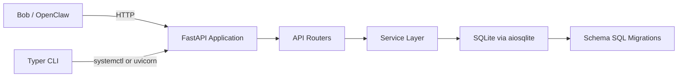
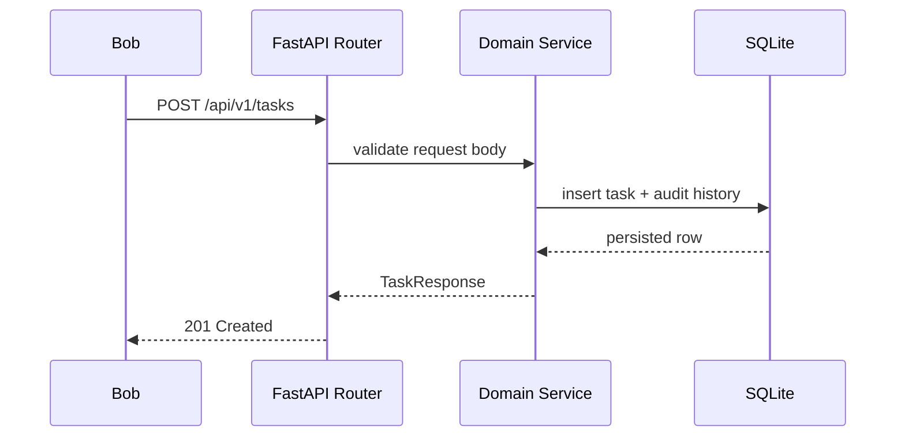
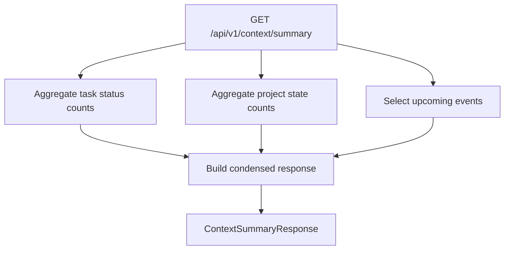
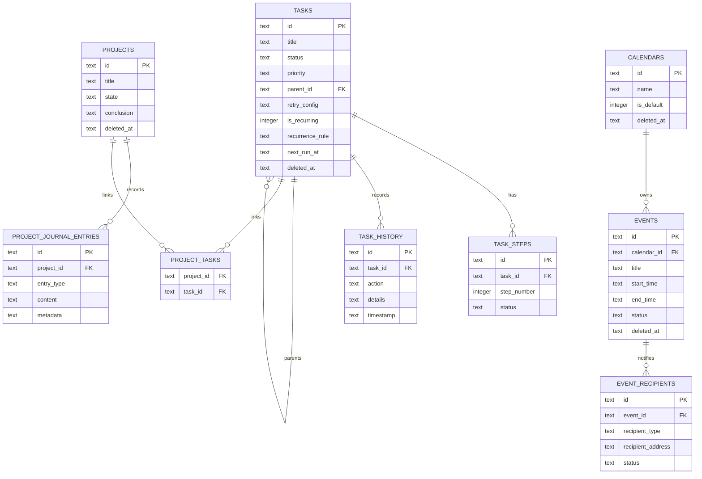

# Cyborg Architecture

## System Overview

## Runtime Data Flow

## Context Summary Flow

## API Summary

### Tasks

- `GET /api/v1/tasks`
- `POST /api/v1/tasks`
- `GET /api/v1/tasks/{id}`
- `PUT /api/v1/tasks/{id}`
- `DELETE /api/v1/tasks/{id}`
- `POST /api/v1/tasks/{id}/start`
- `POST /api/v1/tasks/{id}/complete`
- `POST /api/v1/tasks/{id}/fail`
- `POST /api/v1/tasks/{id}/retry`
- `GET /api/v1/tasks/{id}/steps`
- `POST /api/v1/tasks/{id}/steps`
- `POST /api/v1/tasks/{id}/subtasks`
- `GET /api/v1/tasks/{id}/history`

### Projects

- `GET /api/v1/projects`
- `POST /api/v1/projects`
- `GET /api/v1/projects/{id}`
- `PUT /api/v1/projects/{id}`
- `DELETE /api/v1/projects/{id}`
- `POST /api/v1/projects/{id}/start`
- `POST /api/v1/projects/{id}/pause`
- `POST /api/v1/projects/{id}/close`
- `GET /api/v1/projects/{id}/journal`
- `POST /api/v1/projects/{id}/journal`
- `GET /api/v1/projects/{id}/tasks`

### Calendars and Events

- `GET /api/v1/calendars`
- `POST /api/v1/calendars`
- `GET /api/v1/calendars/{id}`
- `PUT /api/v1/calendars/{id}`
- `DELETE /api/v1/calendars/{id}`
- `GET /api/v1/events`
- `POST /api/v1/events`
- `GET /api/v1/events/{id}`
- `PUT /api/v1/events/{id}`
- `DELETE /api/v1/events/{id}`
- `POST /api/v1/events/{id}/confirm`
- `POST /api/v1/events/{id}/cancel`
- `GET /api/v1/events/{id}/recipients`
- `POST /api/v1/events/{id}/recipients`
- `PUT /api/v1/events/{id}/recipients/{rid}`

### Context

- `GET /api/v1/context/summary`
- `GET /api/v1/context/tasks`
- `GET /api/v1/context/projects`
- `GET /api/v1/context/calendar`

## Database Schema

## Storage Notes

- Migrations are plain SQL files in `cyborg/schemas/`, tracked in `schema_migrations`.
- Soft deletes are implemented with `deleted_at` on primary entities.
- Task history is append-only and records lifecycle and mutation events.
- The database layer uses a small async queue-backed connection pool plus a write lock to keep SQLite writes serialized.
