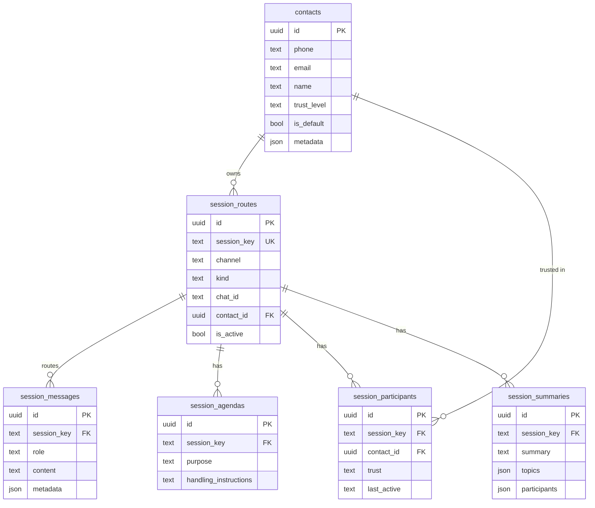
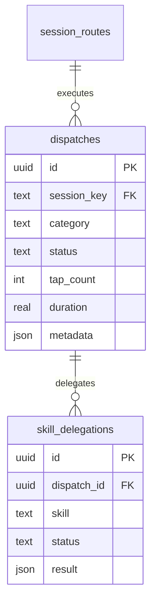
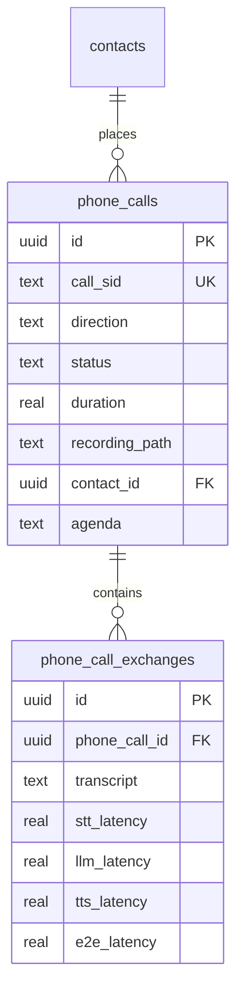
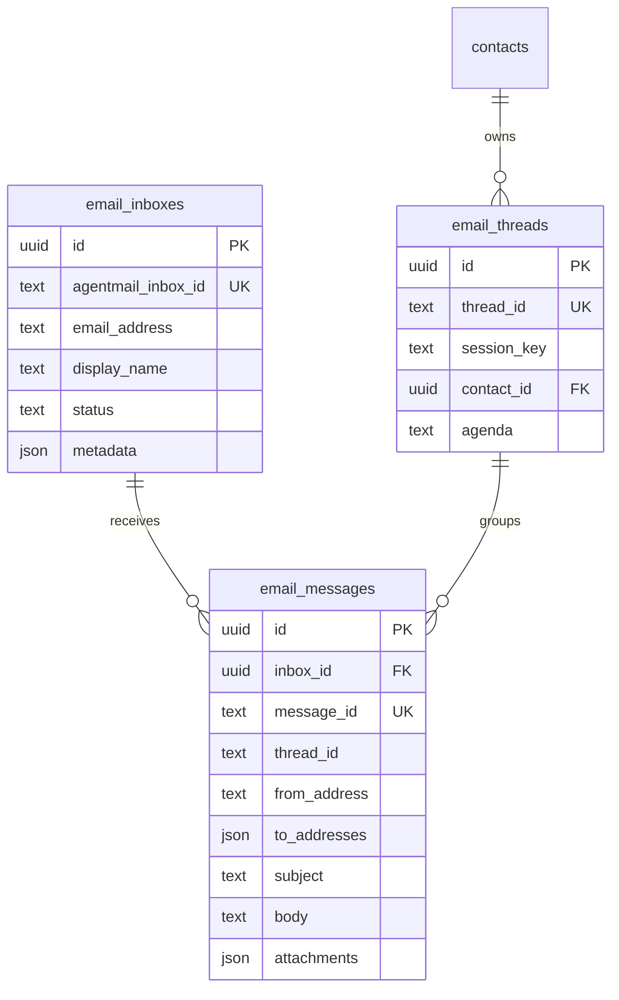
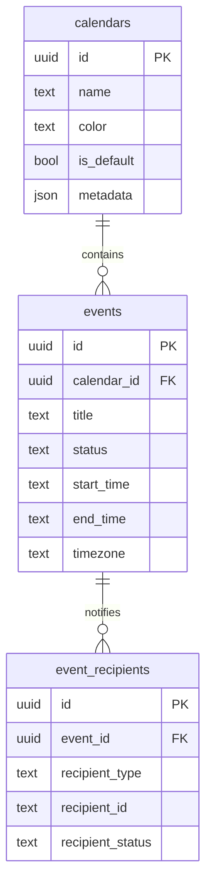
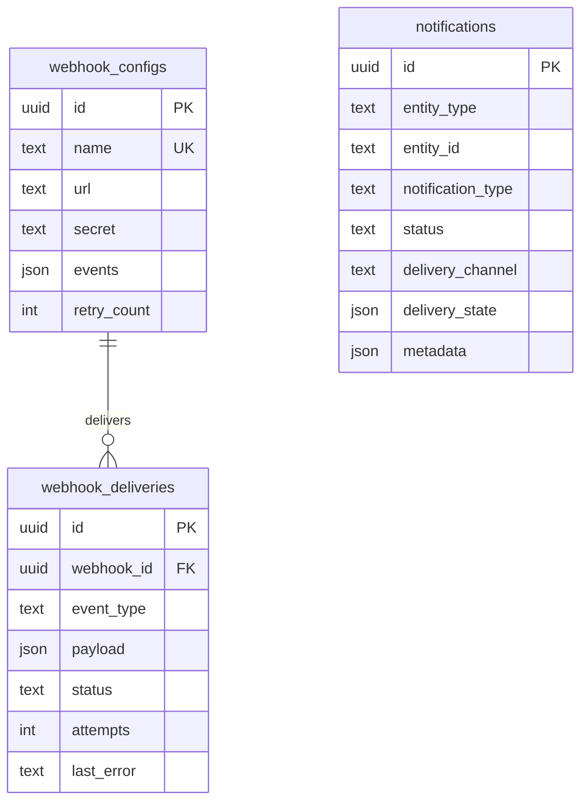

# Data Model

Bob persists everything — WhatsApp messages, emails, voice sessions, phone calls, contacts, memory, calendars, webhooks, dispatches — into a single SQLite database. This document is the canonical reference for that schema, grouped by domain so you can find the tables you care about without scanning a 500-line `CREATE TABLE` dump.

Migrations live under `packages/bob-server/bob_server/schemas/` as numbered `.sql` files (`NNN_description.sql`). They are applied in order at startup by `Database.apply_migrations()` in `packages/bob-server/bob_server/database.py`. The migration runner records applied files in a `schema_migrations` table; existing DBs only get newer migrations, fresh DBs get all of them.

## Conventions

A few conventions apply across the whole schema. They are stated once here so the per-domain sections can focus on relationships and behavior.

**Session keys.** Most messaging-domain tables are joined on a `session_key` string rather than a numeric FK. Session keys are structured identifiers of the form `agent:<scope>:<channel>:<kind>:<peer>` — for example, `agent:main:whatsapp:dm:+61400111222` or `agent:main:whatsapp:group:120363401238199025@g.us`. The `session_routes` table maps a logical session key to its physical channel/kind/chat_id and (optionally) a contact, so code that dispatches or summarises a session can resolve the destination without re-parsing the key.

**JSON metadata columns.** Many tables carry a `metadata` column (JSON object) for channel-specific data that does not earn its own top-level column — `chat_id` for WhatsApp, `message_id` for email headers, `direction` for a call, etc. This is deliberate: it keeps the core schema stable while letting each channel stash what it needs. Treat metadata as read-mostly context, not as a join target.

**Soft vs hard delete.** Most tables hard-delete (rows actually go away). The exceptions are contacts (which can be soft-deleted so historical messages still render a name) and any table with an `is_active` or `status` flag — those flags are the source of truth for "is this still relevant", not row presence.

---

## Sessions and Messaging

The session layer is the spine of the system. Every interaction — inbound or outbound, across every channel — is keyed on a session, and most other tables (dispatches, summaries, agendas, memory bulletins) hang off the same key.

**`contacts`** — The source of truth for "who is this person." A contact carries one or more channel addresses (phone, email, WhatsApp group membership), a trust level (governs whether the agent will act on instructions from them), and JSON metadata. The `is_default` flag picks the contact that dashboard notifications route to when no specific recipient is given.

**`session_routes`** — Maps a logical session key to its physical channel destination. This is what lets the agent say "reply on session X" without having to know whether X is currently a WhatsApp DM, an email thread, or something else. Routes can be deactivated (`is_active = false`) without being deleted, so historical messages still render.

**`session_messages`** — Unified conversation history across all channels. Every message — WhatsApp, email, voice transcript, subagent turn — lands here as `(session_key, role, content, metadata)`. This is the table the memory pipeline reads to build session bulletins.

**`session_agendas`** — Optional per-session system prompt override: a `purpose` and `handling_instructions` that prompt assembly layers in for that session. Set by the contact-creation flow or by an operator, not by the agent itself.

**`session_participants`** — Who is in a group session, with their trust level and last-active timestamp. Drives the participants list injected into the LLM prompt for group chats and the `/who` slash command.

**`session_summaries`** — Periodic LLM-generated summaries of a session's recent traffic, with topic tags. Used to surface "what was said" without replaying every message.

---

## Dispatches

A dispatch is a single tracked unit of agent work: one WhatsApp reply, one email response, one phone call, one voice turn. The dispatch system is what gives the dashboard its "what is Bob doing right now" view and what backs stuck-dispatch detection.

**`dispatches`** — Lifecycle: `active` → (`completed` | `failed` | `timed_out` | `cancelled`). Concurrency limits, stuck-dispatch timeouts, and tapping (the periodic "is this dispatch still alive?" check) all read this table. The `category` column drives dispatch routing and dashboard grouping (e.g. `whatsapp_incoming`, `email_incoming`, `voice_turn`).

**`skill_delegations`** — When a dispatch hands a sub-task to a skill (e.g. "write a script to do X"), the delegation is recorded here so the dashboard can show in-flight skill work and link results back to the dispatch that spawned it.

---

## Phone Calls

Real-time phone integration via Twilio Media Streams. Each call is recorded and split into exchanges (one user utterance + one agent reply) with detailed timing.

**`phone_calls`** — One row per call. `call_sid` is the Twilio identifier; `direction` is `inbound` or `outbound`; `recording_path` points at the audio file under `~/data/calls/` (cleaned up on a retention schedule by the `CallCleanupTask` heartbeat).

**`phone_call_exchanges`** — Per-turn transcript and latency breakdown. The four latency columns (STT, LLM, TTS, end-to-end) back the dashboard's call-performance charts and let you spot which stage is slow.

---

## Email

Email is relayed through AgentMail. Inboxes are registered, messages are stored with their full envelope, and threads are bound to sessions so a reply can continue the same conversation context.

**`email_inboxes`** — Registered AgentMail inboxes that Bob polls. `status` governs whether the polling service picks up messages for this inbox.

**`email_messages`** — Raw envelope + body of every message. Attachments are stored as JSON (filename, content type, base64 content); downloads from trusted senders are persisted to disk, others stay inline only.

**`email_threads`** — The bridge between an email thread and Bob's session model: one thread maps to one session_key, optionally owned by a contact. Without this, every reply would start a fresh context.

---

## Calendars and Events

Calendar support for reminders, scheduled messages, and cross-channel event notifications.

**`calendars`** — Color-coded containers for events. The `is_default` calendar is where events land when no calendar is specified.

**`events`** — Single calendar entry. `status` follows the iCal pattern (`tentative`, `confirmed`, `cancelled`).

**`event_recipients`** — Who should be notified about an event. `recipient_type` is `email`, `phone`, or `channel`; `recipient_status` tracks acknowledgement (`pending`, `confirmed`, `declined`, `tentative`).

---

## Memory

The memory subsystem has its own dedicated documentation at [docs/memory.md](./memory.md). The schema is large enough — entities, claims, bulletins, dreams, questions, reconciliations — that summarising it here would duplicate that doc. The headline:

- **`memory_bulletins`** — Immutable record of something that happened (a session excerpt, a manual note).
- **`memory_claims`** — Atomic typed facts extracted from bulletins (`preference`, `birthday`, `address`, etc.).
- **`memory_entities`** — Small identity rows that claims attach to (`person-jean`, `trip-europe-2024`).
- **`memory_dream_log`** — Audit trail of dream-pipeline runs that turned bulletins into claims.
- **`memory_questions`** — Open questions the reconciliation pipeline raised for an operator to answer.

See [docs/memory.md](./memory.md) for the full pipeline description, claim-type registry, and entity-template mechanics.

---

## Notifications and Webhooks

Outbound delivery: notifications are the "tell the user something" channel, webhooks are the "tell an external system something" channel.

**`webhook_configs`** — Registered outbound webhooks. `events` is a list of event types this webhook cares about (e.g. `dispatch.completed`, `session.created`). `secret` is the HMAC-signing key sent in the webhook header.

**`webhook_deliveries`** — Individual outbound delivery attempts with retry tracking. The heartbeat's webhook task scans for `pending` deliveries and fires them with exponential backoff.

**`notifications`** — User-facing notification queue with per-channel delivery state. Throttled so a flapping entity doesn't spam the dashboard.

---

## Skills

Skill development delegations are tracked in `skill_delegations` (see Dispatches above). Installed skill *definitions* live on disk under `~/workspace/skills/<name>/skill.md` — see [docs/skills.md](./skills.md) for the file format and discovery pipeline.

---

## Audit and utility

A handful of tables exist for operational visibility rather than feature state:

- **`llm_calls`** — One row per LLM dispatch. Drives the dashboard's latency and token charts. The heartbeat's `LLMCallStalenessTask` sweeps stuck calls here.
- **`schema_migrations`** — Which migration files have been applied. Owned exclusively by `Database.apply_migrations()`.

(Run `sqlite3 ~/data/bob.db ".tables"` against a live DB for the authoritative list — the schema is intentionally append-only and grows with each migration.)
