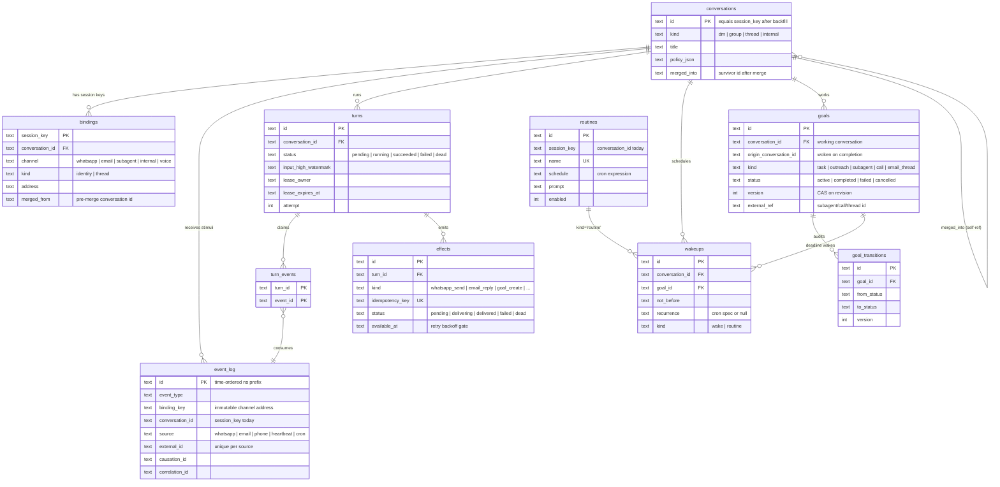
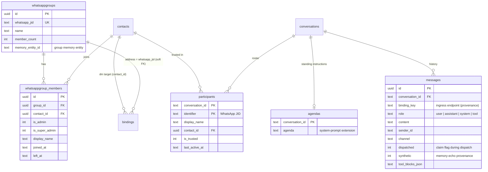
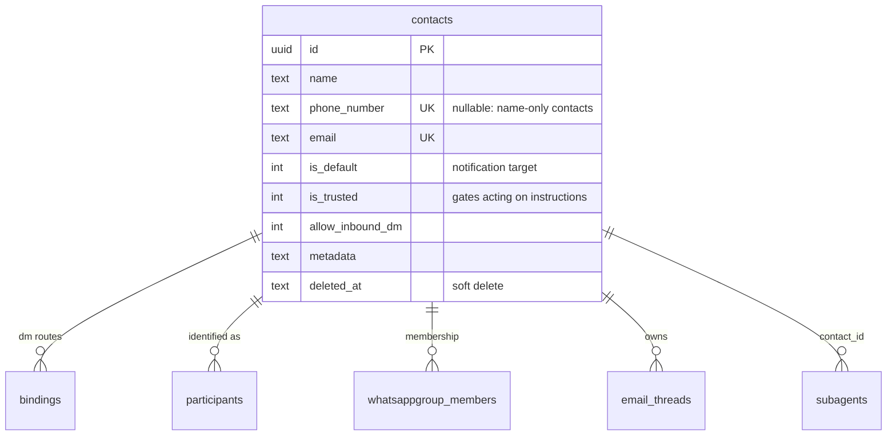
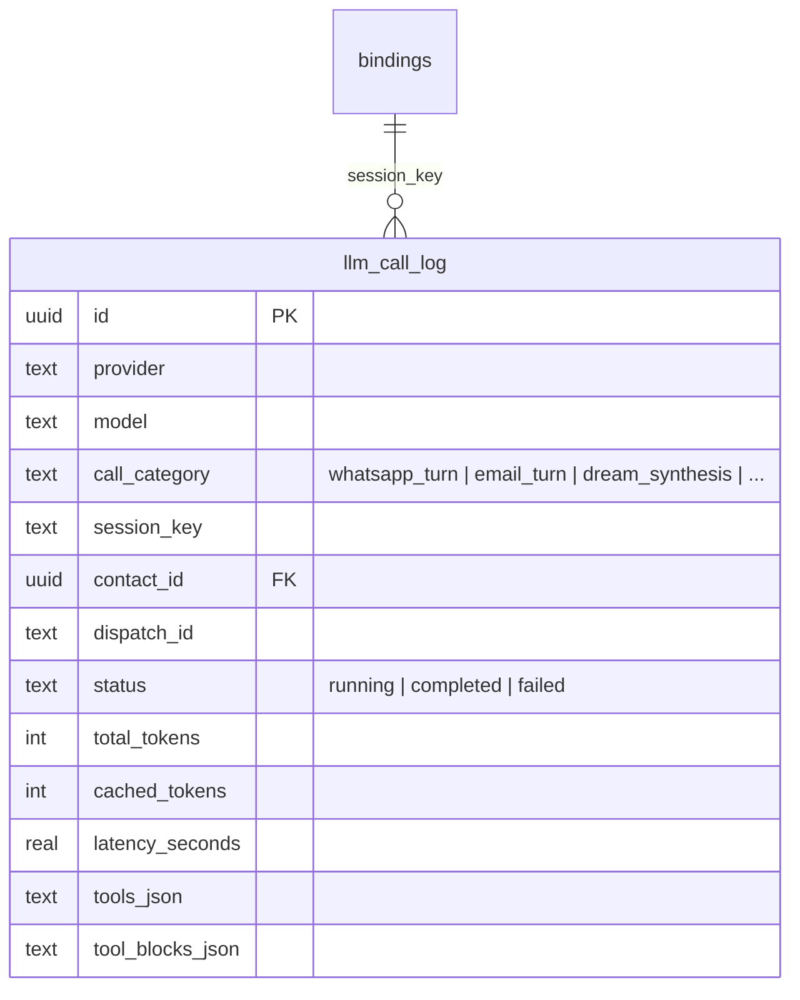
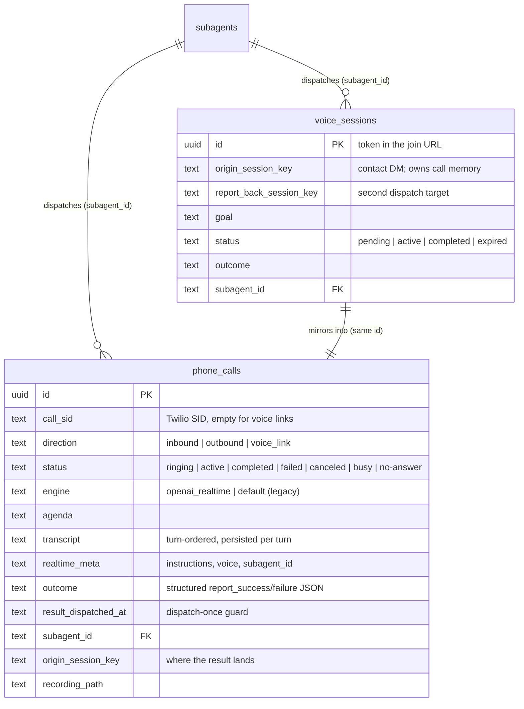
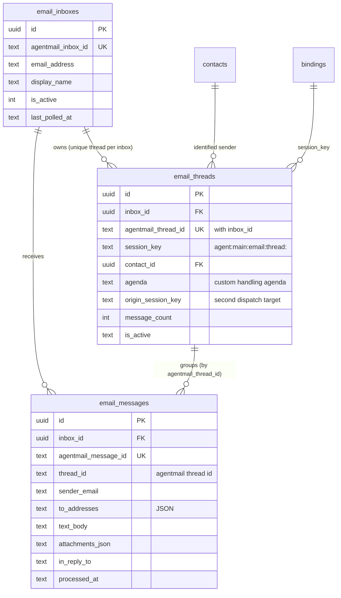
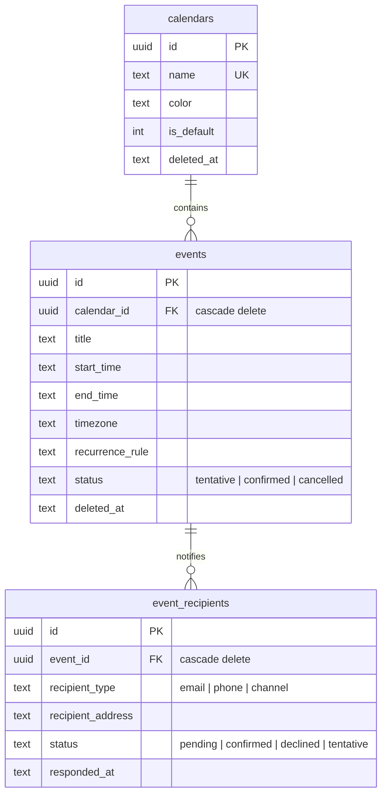
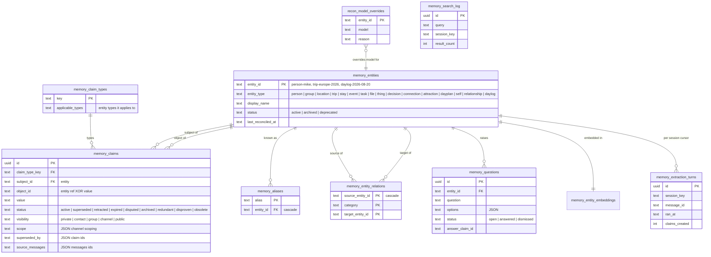
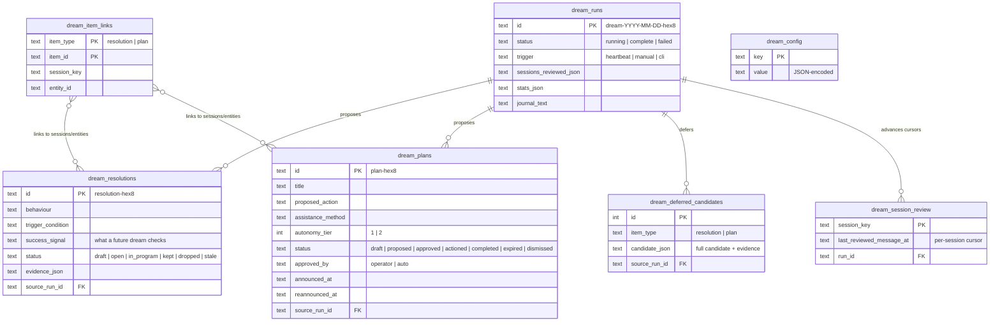
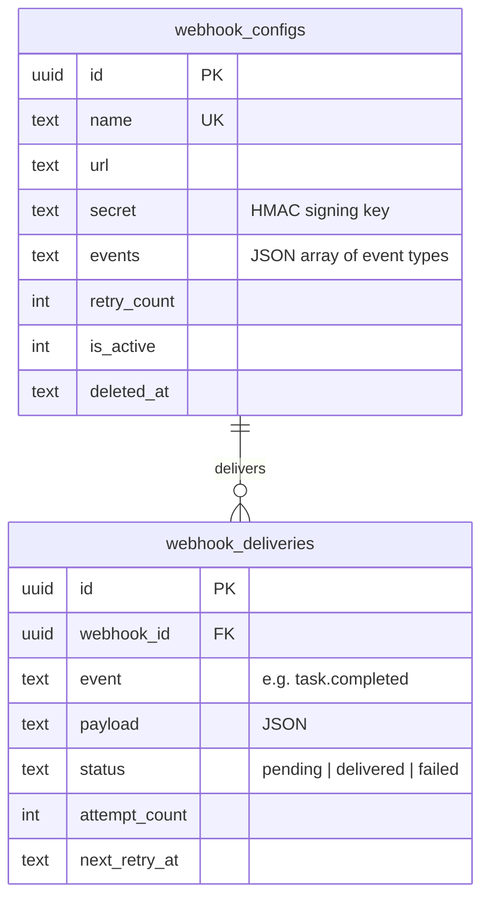

# Data Model

Bob persists everything — WhatsApp messages, emails, voice sessions, phone calls, contacts, memory, calendars, dreams, webhooks, LLM telemetry — into a single SQLite database (default `~/data/bob.db`, override with `BOB_DB_PATH`; WAL journal mode, foreign keys on, 4-connection pool via `aiosqlite`). The schema is the persistent backbone of the system: every channel writes here, every background service reads here, and the dashboard is a thin view over it. Migrations live under `packages/bob-server/bob_server/schemas/` as numbered `.sql` files (`NNN_description.sql`) applied in numeric order at startup by `Database.apply_migrations()` in `packages/bob-server/bob_server/database.py`; applied filenames are recorded in the `schema_migrations` table, so existing databases only run newer files. This document is grouped by domain, so you can find the tables you care about without scanning a 150-file migration dump. It was generated against the migrations through `440_routines_on_wakeups.sql` — verify against the live DB (`sqlite3 ~/data/bob.db ".tables"`) if the schema has moved on.

## Conventions

A few conventions apply across the whole schema. They are stated once here so the per-domain sections can focus on relationships and behavior.

**Session keys.** Most messaging tables are joined on a `session_key` string rather than a numeric FK. Session keys are structured identifiers of the form `agent:<agent>:<channel>:<kind>:<peer>` — for example:

- `agent:main:whatsapp:dm:+61400111222` — a WhatsApp DM, peer is the phone number
- `agent:main:whatsapp:group:120363401238199025` — a WhatsApp group, peer is the group id (JID without `@g.us`)
- `agent:main:email:thread:<agentmail_thread_id>` — an email thread
- `subagent:<parent_session_key>:<short_id>` — a subagent's own session (see `services/subagent_service.py`)

The key is the join column in `bindings` (one per session key), `routines`, `skill_delegations`, `llm_call_log`, `email_threads`, `phone_calls.origin_session_key`, and `subagents` (both `session_key` and `parent_session_key`). The Bob3 event layer carries it twice: `event_log.binding_key` (immutable channel address at ingestion) and `event_log.conversation_id`. Since the Phase VI backfill (migration `430`), `conversations.id` equals the legacy session_key 1:1, and `bindings` maps every session key onto its conversation — key parsing is being replaced by binding lookups, but the string shape above is still what you'll see in the data.

**JSON metadata columns.** Many tables carry a `metadata` (or `*_json`) column holding a JSON object for channel-specific data that does not earn its own top-level column — WhatsApp `chat_id` and media pointers, email header ids, effect payloads, evidence lists. This is deliberate: it keeps the core schema stable while each channel stashes what it needs. Treat these columns as read-mostly context, not as join targets. The notable exception is `memory_claims.source_messages`, which is a JSON array of `messages.id` values used as provenance.

**Soft delete vs hard delete.** Most tables hard-delete: rows actually go away (`DELETE FROM phone_calls` in `CallCleanupTask`, `SessionService.delete_session`). The soft-delete tables set `deleted_at` instead — `contacts`, `calendars`, `events`, `email_inboxes`, `email_threads`, `webhook_configs`, `whatsappgroups` — so history that references them still renders (a deleted contact's messages still show a name). Reads in these tables filter `deleted_at IS NULL` by convention. Separately, several tables never delete at all on purpose: `event_log` is append-only forever (deletions propagate as payload tombstones via `DeletionPropagationTask`), and `llm_call_log` keeps rows forever but redacts heavy payloads after 30 days (`LlmLogRetentionTask`). Where a table has an `is_active` or `status` flag, the flag — not row presence — is the source of truth for "is this still relevant".

---

## Conversations, Events and Turns (Bob3 core runtime)

The newest and most load-bearing domain, introduced by migrations `400`–`440`. The design: every accepted stimulus is appended once to an immutable `event_log`; a `turn` claims a conversation's pending events under a durable lease; external actions are recorded in an `effects` outbox before delivery; `goals` hold durable intent; `wakeups` schedule future work; `conversations` + `bindings` are the identity layer that session keys map onto.

```mermaid
erDiagram
    conversations ||--o{ bindings : "has session keys"
    conversations ||--o{ event_log : "receives stimuli"
    conversations ||--o{ turns : "runs"
    conversations ||--o{ wakeups : "schedules"
    conversations ||--o{ goals : "works"
    conversations ||--o{ conversations : "merged_into (self-ref)"
    turns ||--o{ turn_events : "claims"
    turn_events }o--|| event_log : "consumes"
    turns ||--o{ effects : "emits"
    goals ||--o{ goal_transitions : "audits"
    goals ||--o{ wakeups : "deadline wakes"
    routines ||--o{ wakeups : "kind='routine'"

    conversations {
        text id PK "equals session_key after backfill"
        text kind "dm | group | thread | internal"
        text title
        text policy_json
        text merged_into "survivor id after merge"
    }
    bindings {
        text session_key PK
        text conversation_id FK
        text channel "whatsapp | email | subagent | internal | voice"
        text kind "identity | thread"
        text address
        text merged_from "pre-merge conversation id"
    }
    event_log {
        text id PK "time-ordered ns prefix"
        text event_type
        text binding_key "immutable channel address"
        text conversation_id "session_key today"
        text source "whatsapp | email | phone | heartbeat | cron"
        text external_id "unique per source"
        text causation_id
        text correlation_id
    }
    turns {
        text id PK
        text conversation_id FK
        text status "pending | running | succeeded | failed | dead"
        text input_high_watermark
        text lease_owner
        text lease_expires_at
        int attempt
    }
    turn_events {
        text turn_id PK
        text event_id PK
    }
    effects {
        text id PK
        text turn_id FK
        text kind "whatsapp_send | email_reply | goal_create | ..."
        text idempotency_key UK
        text status "pending | delivering | delivered | failed | dead"
        text available_at "retry backoff gate"
    }
    wakeups {
        text id PK
        text conversation_id FK
        text goal_id FK
        text not_before
        text recurrence "cron spec or null"
        text kind "wake | routine"
    }
    goals {
        text id PK
        text conversation_id FK "working conversation"
        text origin_conversation_id "woken on completion"
        text kind "task | outreach | subagent | call | email_thread"
        text status "active | completed | failed | cancelled"
        int version "CAS on revision"
        text external_ref "subagent/call/thread id"
    }
    goal_transitions {
        text id PK
        text goal_id FK
        text from_status
        text to_status
        int version
    }
    routines {
        text id PK
        text session_key "conversation_id today"
        text name UK
        text schedule "cron expression"
        text prompt
        int enabled
    }
```

**`event_log`** — The single durable record of every accepted stimulus. Append-only: rows are never updated or deleted (retention decision: kept forever; explicit deletions propagate as payload tombstones). The unique partial index on `(source, external_id)` enforces accept-once — a WhatsApp message id or email message id can only ingress one event. Ids are time-ordered (`{nanoseconds}-{hex}`) so lexicographic order equals append order, which turn watermarks rely on.

**`turns`** — Durable execution lease for one LLM turn over a conversation. A partial unique index allows at most one `pending|running` turn per conversation; `input_high_watermark` fixes the input set before execution; `attempt` counts retries (max 3 before `dead`). *How it gets written:* `DispatchRunner` (services/dispatch_runner.py) claims a turn via `TurnRepository.claim()` under `BEGIN IMMEDIATE` before each LLM dispatch, and marks it complete or failed after. A dispatch with no matching events (e.g. group-event notifications) runs without a turn row.

**`turn_events`** — Immutable claim of which events a turn consumed, written at claim time. This is what makes "failure never silently consumes inputs" auditable: the (turn, event) pairs survive even when the turn later fails.

**`effects`** — The outbox. Every external action from a turn is recorded here *before* delivery, keyed by a globally unique `idempotency_key`, then executed inline (write-ahead-inline: latency is unchanged, but a crash between record and delivery leaves a pending row the pump retries with backoff). Executors are registered per `kind` at startup: `whatsapp_send`, `whatsapp_send_media`, `email_reply`, `email_send`, `goal_create`, `goal_revise`, `goal_complete`, `subagent_spawn`. Non-retryable kinds fail straight to `dead` — a duplicate phone call is worse than a lost one. *How it gets written:* `services/effects.py`; drained by `EffectPumpTask` in the heartbeat.

**`wakeups`** — Cancellable, reschedulable scheduled work. Two kinds share the table: `wake` (goal deadlines, one-shot) and `routine` (cron-driven, `payload_json` carries `{"routine_id": ...}`). *How it gets written:* `WakeupRepository.schedule()` from the goal service on deadline-bearing goals; `RoutineService` keeps one scheduled row per enabled routine in sync with CRUD. `WakeupPumpTask` fires due rows each heartbeat.

**`goals`** — Durable intent held by a conversation: what Bob is trying to achieve, its strategy JSON, progress, and result. `conversation_id` is the conversation working the goal; `origin_conversation_id` is the one woken with the result (e.g. the group that asked for a call gets the summary). `external_ref` links the goal to its concrete artifact — subagent id, call id, thread id — and `version` supports compare-and-set revision. Mutations run as effects; every status change appends a row to `goal_transitions`.

**`goal_transitions`** — Append-only audit of goal status changes with the version they happened at.

**`conversations`** — The identity layer: "one dialogue" independent of how many channels it spans. Backfilled 1:1 from session keys (migration `430`), so ids are still session-key-shaped. `merged_into` is set when a conversation is merged away; `kind` in practice is `dm | group | thread | internal`.

**`bindings`** — Maps a channel session key onto a conversation. `kind` distinguishes `identity` bindings (a person's stable address) from `thread` bindings (a channel-specific thread). Merge moves bindings onto the survivor conversation and records `merged_from`/`merged_at` so unmerge can return pre-merge events to their original conversation. This is the seam replacing session-key parsing for outbound routing (`services/wake_service.py: conversation_channel`).

*(`subscriptions`, the reserved ambient-stimuli trigger table from migration `400`, was never wired and was dropped in migration `458`.)*

**`routines`** — Definition store for scheduled per-session prompts: name (unique per session), cron `schedule`, `prompt`, timezone and validity window. Firing rides the unified `wakeups` pump since migration `440`; the old `RoutineSchedulerTask` is gone.

**`attention_shadow`** — One row per attention decision: whether the stimulus was addressed (Tier 0, with reason: `dm | mention_jid | name_variant | reply_to_bot | not_addressed`), the debounce window the coordinator used (Tier 1), and the `ACT | WAIT | STAND_DOWN` decision. Named "shadow" from the pre-cutover soak period; since the Attention coordinator went live it is the coordinator's audit trail (`services/attention/`). Telemetry only — never enters `event_log`, safe to prune.

---

## Sessions and Messaging

The session layer keys all channel traffic. Every inbound or outbound message — WhatsApp, email, voice transcript, subagent turn — lands in `messages` keyed by `conversation_id`; `bindings` (see Conversations above) resolves a session key to a physical destination via `ConversationRepository.route_for`.

**Glossary — three identifiers, three jobs:**

- **`conversation_id`** — the durable identity of a conversation (`conversations.id`). What history, participants, agendas, memories and turns hang off. Since migration `430` it equals the legacy session key 1:1; when bindings merge, several keys map onto one surviving conversation_id.
- **`binding_key`** (a.k.a. legacy *session key*) — the immutable channel ingress name a message actually arrived on (`agent:main:whatsapp:dm:<phone>`, …). Preserved verbatim on `messages.binding_key` and `event_log.binding_key` so provenance survives merges. Resolved to a conversation via `bindings.session_key → bindings.conversation_id`.
- **`address`** — the physical send target on a binding (`bindings.address`: a JID, email address, or phone number) plus `endpoint_kind`. What `route_for` returns for outbound delivery.

```mermaid
erDiagram
    contacts ||--o{ bindings : "dm target (contact_id)"
    contacts ||--o{ participants : "trusted in"
    whatsappgroups ||--o{ whatsappgroup_members : "has"
    contacts ||--o{ whatsappgroup_members : "joins"
    whatsappgroups ||--o{ bindings : "address = whatsapp_jid (soft FK)"
    conversations ||--o{ messages : "history"
    conversations ||--o{ participants : "roster"
    conversations ||--o| agendas : "standing instructions"

    messages {
        uuid id PK
        text conversation_id FK
        text binding_key "ingress endpoint (provenance)"
        text role "user | assistant | system | tool"
        text content
        text sender_id
        text channel
        int dispatched "claim flag during dispatch"
        int synthetic "memory-echo provenance"
        text tool_blocks_json
    }
    agendas {
        text conversation_id PK
        text agenda "system-prompt extension"
    }
    participants {
        text conversation_id PK
        text identifier PK "WhatsApp JID"
        text display_name
        uuid contact_id FK
        int is_trusted
        text last_active_at
    }
    whatsappgroups {
        uuid id PK
        text whatsapp_jid UK
        text name
        int member_count
        text memory_entity_id "group memory entity"
    }
    whatsappgroup_members {
        uuid id PK
        uuid group_id FK
        uuid contact_id FK
        int is_admin
        int is_super_admin
        text display_name
        text joined_at
        text left_at
    }
```

**`messages`** (renamed from `session_messages`, migration `457`) — The source of truth for conversation history across all channels; the memory pipeline, prompt assembly, dreams, reflection and the dashboard all read it. Keyed by `conversation_id`, with `binding_key` preserving the exact ingress endpoint the message rode (mirrors `event_log.binding_key`). `dispatched` is a claim flag: inbound user messages are stored undispatched at ingress (so a crash before dispatch is recovered by the startup sweep), then claimed by a dispatch and marked dispatched — LLM quota failure restores them. `synthetic` marks assistant messages that are echoes of existing memory rather than new ground truth, and `tool_summary`/`tool_blocks_json` persist the dispatch's tool-call trace for replay in later prompts. *How it gets written:* `SessionService.add_message` (services/session_service.py) is the only writer; `HistoryRepository` (repositories/history.py) is the single read seam. `DELETE FROM messages WHERE conversation_id = ?` is the session-clearing path.

**Routing** — `session_routes` was dropped (migration `455`); its job — "reply on session X: where does X physically live?" — moved onto `bindings` (`address`, `endpoint_kind`, `contact_id`, `is_active`). `ConversationRepository.route_for` is the resolver, and channel ingress (WhatsApp bridge, email poller, phone/voice) calls `ConversationRepository.register_endpoint` on first contact. Per-session config that used to hide in route metadata lives in `conversations.policy_json`.

**`agendas`** (renamed from `session_agendas`, migration `456`) — Optional per-conversation system-prompt extension (one row per conversation, the whole agenda in one text blob). The WhatsApp bridge and email poller seed a default agenda on session creation — the untrusted-sender caution text for unknown contacts, a custom one when the contact sets an agenda — and prompt assembly layers it in. Written by `SessionAgendaService` via `AgendaRepository`.

**`participants`** (renamed from `session_participants`, migration `456`) — Who is in a conversation: identifier (WhatsApp JID), display name, optional contact link, trust flag, last-active time. FK to `conversations` and `contacts`; written via `ParticipantRepository`. Drives the participant list injected into group-chat prompts and mention resolution. Written by the WhatsApp bridge on every group message and group sync.

**`whatsappgroups` / `whatsappgroup_members`** — Channel-specific group registry: JID, name, member count, and the group's memory entity (`memory_entity_id`, set when `ensure_group_entity` creates the corresponding `group-*` memory entity). Members carry admin flags and join/leave times. Written by the bridge's group-sync and member-change handlers (`services/whatsapp_bridge_service/_group_events.py`). Note the known wrinkle documented in [docs/session-mess.md](./session-mess.md): the join to `bindings` is by convention (`address = whatsapp_jid`), not a real FK.

*(`session_summaries` existed here historically — idle-session LLM summaries — and was dropped in migration `313`. Idle sessions now go straight to silent-turn memory extraction, leaving the `memory_extraction_turns` cursor behind.)*

---

## Contacts

```mermaid
erDiagram
    contacts ||--o{ bindings : "dm routes"
    contacts ||--o{ participants : "identified as"
    contacts ||--o{ whatsappgroup_members : "membership"
    contacts ||--o{ email_threads : "owns"
    contacts ||--o{ subagents : "contact_id"

    contacts {
        uuid id PK
        text name
        text phone_number UK "nullable: name-only contacts"
        text email UK
        int is_default "notification target"
        int is_trusted "gates acting on instructions"
        int allow_inbound_dm
        text metadata
        text deleted_at "soft delete"
    }
```

**`contacts`** — The source of truth for "who is this person": one row per human, carrying whatever channel addresses are known (phone and email are both unique-but-nullable, so a contact can be email-only, phone-only, or name-only — name-only rows come from memory entity extraction). `is_trusted` gates whether the agent will act on instructions from them (untrusted senders get the caution agenda), `allow_inbound_dm` gates whether inbound DMs dispatch at all, and `is_default` picks the contact that operator-facing output routes to when no recipient is given. Soft-deleted so their message history keeps rendering a name. *How it gets written:* dashboard/REST CRUD (`routers/contacts.py`) and CLI (`cli/contacts.py`); auto-created on inbound phone calls from unknown numbers (`routers/phone.py`) and by the WhatsApp contact flow. The memory system cross-references contacts via `contact_id`-typed claims (see Memory below) and `person-*` entity naming.

---

## Dispatches and LLM telemetry

A "dispatch" is one tracked unit of agent work: one WhatsApp reply, one email response, one voice turn. The tracking substrate has moved twice — the original `dispatches` table was frozen and then dropped (migration `458`), and today a dispatch is identified by an in-memory `dispatch_id` that threads `llm_call_log` rows and `messages` metadata, with durable turn tracking in `turns` (see the Bob3 core domain above).

```mermaid
erDiagram
    bindings ||--o{ llm_call_log : "session_key"

    llm_call_log {
        uuid id PK
        text provider
        text model
        text call_category "whatsapp_turn | email_turn | dream_synthesis | ..."
        text session_key
        uuid contact_id FK
        text dispatch_id
        text status "running | completed | failed"
        int total_tokens
        int cached_tokens
        real latency_seconds
        text tools_json
        text tool_blocks_json
    }
```

**`llm_call_log`** — One row per LLM call, whatever subsystem made it. This is what backs the dashboard's latency/token/cost charts and the home-screen activity rankings; `call_category` slices by pipeline (`whatsapp_incoming`, `email_incoming`, `memory_claim_extraction`, `dream_synthesis`, `attention_probe`, …). Rows live forever but are payload-redacted after 30 days (`LlmLogRetentionTask` strips prompts/messages/responses/tool blocks, keeping metrics) — telemetry once grew to 2.4 GB of a 2.5 GB database, which is why. `LLMCallStalenessTask` sweeps calls stuck `running` for 30 minutes to `failed`. *How it gets written:* `LLMDispatchService` (services/llm_dispatch.py) on every call.

### Subagents

**`subagents`** — One row per spawned subagent: a Claude Code CLI worker or an `openai_voice` worker. The subagent runs under its own session key (`subagent:<parent_session_key>:<short_id>`), so its turns land in `messages` like any other session; `parent_session_key` links it back to the conversation that spawned it; `agent_type`/`modality` record what kind of worker it is (modality aliases are normalised defensively — the LLM invents enum values); `contact_id` records who the work concerns (used by voice outreach); `status`/`result`/`cost_usd` track completion. Spawning runs as a `subagent_spawn` effect, and a subagent id is what `goals.external_ref` and `phone_calls.subagent_id` point at. *How it gets written:* `services/subagent_service.py` on `create_subagent`; completion marks the row and wakes the parent session with the result via the wake path.

---

## Phone Calls and Voice Sessions

All realtime voice — Twilio phone calls and browser voice-link calls — runs the same OpenAI Realtime bridge (`services/realtime_bridge.py`); a browser voice link is the same call without the Twilio leg. `phone_calls` is the unified call record; `voice_sessions` is the source of truth for browser sessions, mirrored row-for-row into `phone_calls` (same id, `direction='voice_link'`).

```mermaid
erDiagram
    subagents ||--o{ phone_calls : "dispatches (subagent_id)"
    subagents ||--o{ voice_sessions : "dispatches (subagent_id)"
    voice_sessions ||--|| phone_calls : "mirrors into (same id)"

    phone_calls {
        uuid id PK
        text call_sid "Twilio SID, empty for voice links"
        text direction "inbound | outbound | voice_link"
        text status "ringing | active | completed | failed | canceled | busy | no-answer"
        text engine "openai_realtime | default (legacy)"
        text agenda
        text transcript "turn-ordered, persisted per turn"
        text realtime_meta "instructions, voice, subagent_id"
        text outcome "structured report_success/failure JSON"
        text result_dispatched_at "dispatch-once guard"
        text subagent_id FK
        text origin_session_key "where the result lands"
        text recording_path
    }
    voice_sessions {
        uuid id PK "token in the join URL"
        text origin_session_key "contact DM; owns call memory"
        text report_back_session_key "second dispatch target"
        text goal
        text status "pending | active | completed | expired"
        text outcome
        text subagent_id FK
    }
```

**`phone_calls`** — One row per call, any modality. `realtime_meta` carries the dispatch configuration (instructions, voice, max duration, `subagent_id`) durably so the Twilio media-stream handler can recover the call from the DB after a restart between dial and answer; the in-process `call_agendas` cache is a hot-path copy only. `transcript` is turn-ordered (`Agent:` / `User:` lines) and written at every turn boundary, so it is readable mid-call and survives a bridge crash. `outcome` holds the structured `report_success` / `report_failure` tool result as JSON. `result_dispatched_at` is an atomic claim-by-UPDATE guard so the summary dispatches to `origin_session_key` exactly once, across restarts and concurrent callers. *How it gets written:* `services/voice_dispatch_service.py` is the single owner of placement (outbound Twilio rows), `routers/phone.py` creates inbound rows and owns the media-stream lifecycle, `VoiceSessionService` writes the voice-link mirror rows. *Retention:* `CallCleanupTask` deletes calls (and their recordings) completed more than `phone.call_recording_max_age_days` ago. Call summaries relay to their session via `services/phone_call_result_service.py` on the wake path.

**`voice_sessions`** — Source of truth for browser voice-link calls. The id *is* the token in the join URL — a capability: anyone holding the link can join as Bob until the session completes. `origin_session_key` is normally the contact's DM (so the transcript lands in the relationship's memory), with `report_back_session_key` dispatching the summary to a second session (e.g. the group that asked for the reach-out). Untapped links expire after 24 hours (`VoiceSessionService.LINK_TTL_HOURS = 24`, mirrored to the `phone_calls` row as `canceled`); completion flows through `VoiceSessionService.complete`.

*(The empty legacy tables `phone_call_exchanges`, `voice_current_lesson` and `voice_lesson_progress` — remnants of the retired local STT→TTS pipeline and language-practice frontend — were dropped in migration `458`; `voice_session_messages` was archived into `messages` with `provenance='legacy_voice'` in migration `454`.)*

---

## Email

Email is relayed through AgentMail. Inboxes are registered, every message is stored with its full envelope, and each thread is bound to a session so a reply continues the same conversation context.

```mermaid
erDiagram
    email_inboxes ||--o{ email_messages : "receives"
    email_inboxes ||--o{ email_threads : "owns (unique thread per inbox)"
    email_threads ||--o{ email_messages : "groups (by agentmail_thread_id)"
    contacts ||--o{ email_threads : "identified sender"
    bindings ||--o{ email_threads : "session_key"

    email_inboxes {
        uuid id PK
        text agentmail_inbox_id UK
        text email_address
        text display_name
        int is_active
        text last_polled_at
    }
    email_messages {
        uuid id PK
        uuid inbox_id FK
        text agentmail_message_id UK
        text thread_id "agentmail thread id"
        text sender_email
        text to_addresses "JSON"
        text text_body
        text attachments_json
        text in_reply_to
        text processed_at
    }
    email_threads {
        uuid id PK
        uuid inbox_id FK
        text agentmail_thread_id UK "with inbox_id"
        text session_key "agent:main:email:thread:<id>"
        uuid contact_id FK
        text agenda "custom handling agenda"
        text origin_session_key "second dispatch target"
        int message_count
        text is_active
    }
```

**`email_inboxes`** — Registered AgentMail inboxes that Bob polls. `is_active` gates whether the poller picks the inbox up; `last_polled_at` drives incremental polling. Soft-deleted rather than dropped so thread history survives an inbox retirement. Registered via the email REST router.

**`email_messages`** — Raw envelope plus body of every message, inbound and outbound (sent messages are persisted with label `sent` so a thread's history is complete). Attachments are JSON; downloads from trusted senders are persisted into the workspace, executables and code files are blocklisted at the source. *How it gets written:* `EmailPollingService` (services/email_polling_service.py) — polled every heartbeat and fully reconciled every 10th cycle by `EmailSyncTask` — and `EmailDeliveryService` for sent messages.

**`email_threads`** — The bridge between an email thread and the session model: one AgentMail thread maps to one `session_key` (`agent:main:email:thread:<agentmail_thread_id>`), optionally identified with a contact. Without this every reply would start a fresh context. `agenda` holds a custom handling agenda for the thread (seeded on first message, else the default email agenda), and `origin_session_key` routes results to a second session when the thread was started from one (cleared after dispatch so later replies stay in-thread). Thread rows are canonicalized at send as well as at ingest — outbound-first threads get their row before the first reply is sent.

---

## Calendars and Events

Calendar support for reminders and event notifications.

```mermaid
erDiagram
    calendars ||--o{ events : "contains"
    events ||--o{ event_recipients : "notifies"

    calendars {
        uuid id PK
        text name UK
        text color
        int is_default
        text deleted_at
    }
    events {
        uuid id PK
        uuid calendar_id FK "cascade delete"
        text title
        text start_time
        text end_time
        text timezone
        text recurrence_rule
        text status "tentative | confirmed | cancelled"
        text deleted_at
    }
    event_recipients {
        uuid id PK
        uuid event_id FK "cascade delete"
        text recipient_type "email | phone | channel"
        text recipient_address
        text status "pending | confirmed | declined | tentative"
        text responded_at
    }
```

**`calendars`** — Color-coded containers for events; the `is_default` calendar is where events land when none is specified. Soft-deleted.

**`events`** — Single calendar entries. `status` follows the iCal pattern (`tentative`/`confirmed`/`cancelled`); `recurrence_rule` carries an RRULE for repeating events. Soft-deleted.

**`event_recipients`** — Who should be notified about an event; `recipient_status` tracks acknowledgement. All three tables are written by `CalendarService` (services/calendar_service.py) behind the calendars REST router and CLI (`cli/calendars.py`, `cli/events.py`).

---

## Memory

The memory subsystem has its own documentation at [docs/memory.md](./memory.md). The current shape is **v7, claim-centric**: claims are the source of truth, entities are identity-only rows, and rendered views are generated from claims via per-type templates. (The bulletin tables the older memory doc describes have been dropped; the summary below reflects what is actually in the schema today.)

```mermaid
erDiagram
    memory_claim_types ||--o{ memory_claims : "types"
    memory_entities ||--o{ memory_claims : "subject of"
    memory_entities ||--o{ memory_claims : "object of"
    memory_entities ||--o{ memory_aliases : "known as"
    memory_entities ||--o{ memory_entity_relations : "source of"
    memory_entities ||--o{ memory_entity_relations : "target of"
    memory_entities ||--o{ memory_questions : "raises"
    memory_entities ||--|| memory_entity_embeddings : "embedded in"
    memory_entities ||--o{ memory_extraction_turns : "per session cursor"
    recon_model_overrides }o--|| memory_entities : "overrides model for"

    memory_entities {
        text entity_id PK "person-mike, trip-europe-2026, daylog-2026-08-20"
        text entity_type "person | group | location | trip | stay | event | task | file | thing | decision | connection | attraction | dayplan | self | relationship | daylog"
        text display_name
        text status "active | archived | deprecated"
        text last_reconciled_at
    }
    memory_claim_types {
        text key PK
        text applicable_types "entity types it applies to"
    }
    memory_claims {
        uuid id PK
        text claim_type_key FK
        text subject_id FK "entity"
        text object_id "entity ref XOR value"
        text value
        text status "active | superseded | retracted | expired | disputed | archived | redundant | disproven | obsolete"
        text visibility "private | contact | group | channel | public"
        text scope "JSON channel scoping"
        text superseded_by "JSON claim ids"
        text source_messages "JSON messages ids"
    }
    memory_aliases {
        text alias PK
        text entity_id FK "cascade"
    }
    memory_entity_relations {
        text source_entity_id PK "cascade"
        text category PK
        text target_entity_id PK
    }
    memory_questions {
        uuid id PK
        text entity_id FK
        text question
        text options "JSON"
        text status "open | answered | dismissed"
        text answer_claim_id
    }
    memory_extraction_turns {
        uuid id PK
        text session_key
        text message_id
        text ran_at
        int claims_created
    }
    memory_search_log {
        uuid id PK
        text query
        text session_key
        int result_count
    }
    recon_model_overrides {
        text entity_id PK
        text model
        text reason
    }
```

**`memory_entities`** — Small identity rows that claims attach to; the id encodes type and slug (`person-jean`, `group-saturday-soccer`, `daylog-2026-08-20`). Entities have no body — everything a "profile" would hold lives in claims and is rendered on demand. `status` supports archiving and deprecating (merge cleanup rewrites claims to canonical ids and removes duplicates).

**`memory_claim_types`** — The registry of claim types (seeded by migration `317`): which entity types each applies to, a description and an example. Extraction and reconciliation both consult it; `contact_id` claims are the cross-reference into the contacts table (indexed on `(claim_type_key, value, status)` for the contact→entity lookup).

**`memory_claims`** — Atomic typed facts — the heart of the system. A claim points *at* an entity (`object_id`) or holds a literal (`value`), never both (enforced by CHECK). `status` models the full claim lifecycle (superseded/retracted/disputed/...); `superseded_by` chains replacements; `visibility` + `scope` control which channels a claim renders in; `source_messages` preserves provenance back to `messages` ids. *How it gets written:* live writes from the agent's memory tools, and background extraction — `SessionIdleSummaryTask` (heartbeat) finds sessions idle past the threshold and runs silent-turn extraction, leaving a `memory_extraction_turns` cursor behind.

**`memory_aliases`** — Name variants mapped to canonical entities, powering `recall` by name. Maintained by the index service on entity write.

**`memory_entity_relations`** — Typed edges between entities (`(source, category, target)`), e.g. trip→stay containment. Cascade with their entity.

**`memory_entity_embeddings` / `memory_entities_fts`** — Vector index (sqlite-vec, 1536-dim) and FTS5 index over entities for semantic and name search respectively; both are derived and rebuildable.

**`memory_questions`** — Open questions the reconciliation pipeline raised for an operator to answer (conflicts it could not resolve autonomously); an answer can mint a claim (`answer_claim_id`). Written by `services/memory/reconciliation.py`.

**`memory_extraction_turns`** — Cursor table: one row per silent extraction run per session/message, so extraction is incremental rather than full-history. Read by the idle-summary task to find sessions with unextracted traffic.

**`memory_search_log`** — Telemetry on recall/find queries (results, latency) — usage debugging, not feature state.

**`recon_model_overrides`** — Per-entity LLM model override for reconciliation (some entities need a stronger model than the default), with the reason recorded.

---

## Dreams

Idle-time reflection over recent sessions: dream runs review traffic, propose resolutions (behaviour changes) and plans (concrete next steps), and synthesise a journal. All SQL lives in `services/dream/store.py`.

```mermaid
erDiagram
    dream_runs ||--o{ dream_resolutions : "proposes"
    dream_runs ||--o{ dream_plans : "proposes"
    dream_runs ||--o{ dream_deferred_candidates : "defers"
    dream_runs ||--o{ dream_session_review : "advances cursors"
    dream_item_links }o--o{ dream_resolutions : "links to sessions/entities"
    dream_item_links }o--o{ dream_plans : "links to sessions/entities"

    dream_runs {
        text id PK "dream-YYYY-MM-DD-hex8"
        text status "running | complete | failed"
        text trigger "heartbeat | manual | cli"
        text sessions_reviewed_json
        text stats_json
        text journal_text
    }
    dream_session_review {
        text session_key PK
        text last_reviewed_message_at "per-session cursor"
        text run_id FK
    }
    dream_resolutions {
        text id PK "resolution-hex8"
        text behaviour
        text trigger_condition
        text success_signal "what a future dream checks"
        text status "draft | open | in_program | kept | dropped | stale"
        text evidence_json
        text source_run_id FK
    }
    dream_plans {
        text id PK "plan-hex8"
        text title
        text proposed_action
        text assistance_method
        int autonomy_tier "1 | 2"
        text status "draft | proposed | approved | actioned | completed | expired | dismissed"
        text approved_by "operator | auto"
        text announced_at
        text reannounced_at
        text source_run_id FK
    }
    dream_item_links {
        text item_type PK "resolution | plan"
        text item_id PK
        text session_key
        text entity_id
    }
    dream_deferred_candidates {
        int id PK
        text item_type "resolution | plan"
        text candidate_json "full candidate + evidence"
        text source_run_id FK
    }
    dream_config {
        text key PK
        text value "JSON-encoded"
    }
```

**`dream_runs`** — One row per reflection run, with the window reviewed (coverage is really per-session cursors), stats, and the synthesised journal text. Runs fire from `DreamTask` on the heartbeat when idle, or manually via CLI. `dream_config` (e.g. `auto_approve_plans`) tunes behaviour without redeploying.

**`dream_session_review`** — The per-session cursor: which message timestamp a session has been reviewed up to. This is what makes dream coverage incremental.

**`dream_resolutions`** — Observed behaviours (good or bad) with the trigger condition and a success signal a future dream checks to mark them `kept`. `evidence_json` preserves the excerpts that motivated them.

**`dream_plans`** — Concrete proposed actions with an autonomy tier (1 = needs operator approval, 2 = auto-approved within scope). The announce flow (`services/dream/announce.py`) posts approved plans into their evidence session once (`announced_at`), with a single follow-up allowed (`reannounced_at`). `task_id` is reserved — no execution engine exists today.

**`dream_item_links`** — Many-to-many links from resolutions/plans to the sessions and memory entities they came from, so items surface in later prompts when related traffic appears.

**`dream_deferred_candidates`** — Candidates the run produced but did not commit (e.g. below confidence, or deferral configured); kept with full evidence so a later run or the operator can promote them. `dream_item_embeddings` (sqlite-vec) indexes items for similarity.

---

## Webhooks

Outbound delivery to external systems. The event vocabulary targets the dropped projects/tasks domain, so no deliveries are produced today; the API surface (`routers/webhooks.py`, `cli/webhooks.py`) remains wired.

```mermaid
erDiagram
    webhook_configs ||--o{ webhook_deliveries : "delivers"

    webhook_configs {
        uuid id PK
        text name UK
        text url
        text secret "HMAC signing key"
        text events "JSON array of event types"
        int retry_count
        int is_active
        text deleted_at
    }
    webhook_deliveries {
        uuid id PK
        uuid webhook_id FK
        text event "e.g. task.completed"
        text payload "JSON"
        text status "pending | delivered | failed"
        int attempt_count
        text next_retry_at
    }
```

**`webhook_configs`** — Registered outbound webhooks. `events` lists the event types a hook cares about; `secret` is the HMAC key sent in the delivery header. CRUD via `routers/webhooks.py` and `cli/webhooks.py`; soft-deleted.

**`webhook_deliveries`** — Individual delivery attempts with retry tracking and exponential backoff (`next_retry_at`). The delivery loop (`services/webhook_service.py`) exists, but its event vocabulary (`task.completed`, `project.blocked`, …) targets the frozen task/project domain, so no deliveries are being produced today.

---

## Skills

Skill *definitions* live on disk under `~/workspace/skills/<name>/` (`skill.md` + optional helper scripts) and are discovered lazily at prompt time — see [docs/skills.md](./skills.md) for the format and discovery pipeline. Only *development delegations* are tracked in the database:

**`skill_delegations`** — Records each operator-initiated skill-development job (user story, plan, the spawned Claude session id, files created, result summary, cost) so the dashboard can show delegation history and link results back. Written by `SkillDeveloperService` via the dashboard skills API; the LLM itself does not create these.

---

## Audit and utility

Tables that exist for operational visibility or configuration rather than feature state:

- **`schema_migrations`** — Which migration filenames have been applied (`name` PK, `applied_at`). Owned exclusively by `Database.apply_migrations()`; the runner tolerates "duplicate column" errors so re-running idempotent migrations on partially-migrated databases does not brick startup.
- **`persona_records`** — Versioned persona source (soul, identity, agents, user content, config) with a monotonically unique `revision` and exactly one `is_active` row; prompt assembly reads the active record. Written via `routers/persona.py`.
- **`location_history`** — Periodic device pings from Home Assistant (lat/long, zone, battery) appended by `LocationFetchTask` on the heartbeat; feeds trip/daylog journaling. Append-only telemetry.
- **`eval_runs` / `eval_case_results`** — Output of the eval harness (`evals/runner.py`, driven by the CLI eval commands): per-case pass/fail, judge score, structural checks, and the exact input messages for reproducibility.

---

## Dropped legacy domains

The first-generation self-executing-project domain (`projects`, `tasks`, `plans`, `task_steps`, `task_history`, `task_files`, `project_*`, `approvals`, `notifications`, `subscriptions`, `dispatches`) stopped being written around May 2026 and was dropped in migration `458`, along with the orphaned `prompt_history`, `harness_logs`, `persona_config` and the empty voice/phone remnants (`voice_current_lesson`, `voice_lesson_progress`, `phone_call_exchanges`). All rows are archived in `~/data/archive/bob-legacy-tables-2026-08-23.sql`.

---

*Generated from the migrations and services of the `bob-server` package. When the schema evolves, regenerate or update this file in the same change — a stale data-model doc is worse than none. `sqlite3 ~/data/bob.db ".schema <table>"` always has the authoritative answer.*
